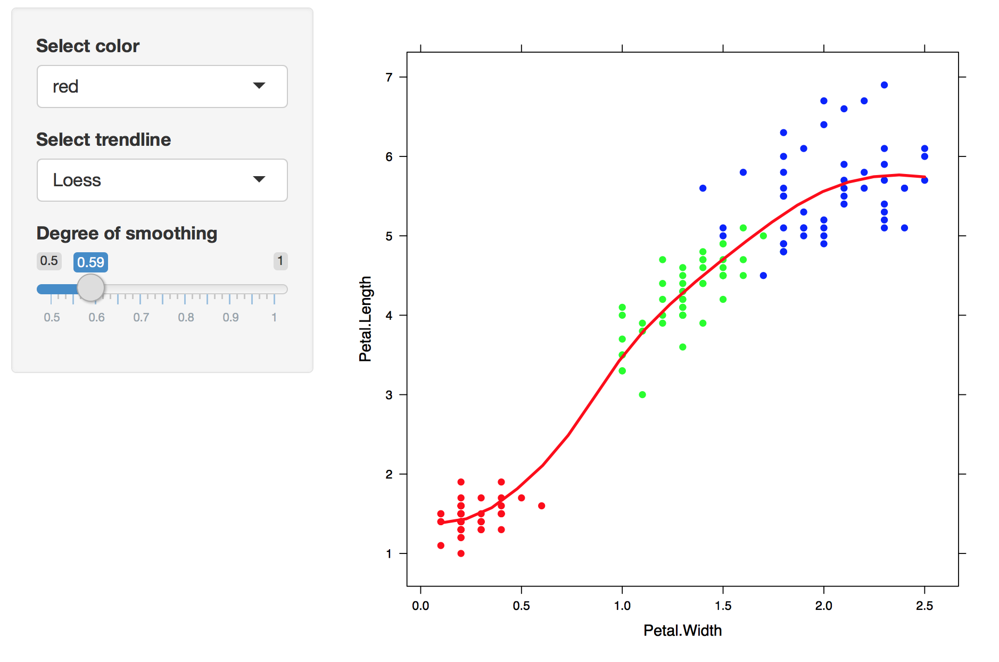

---
output:
  html_document:
    toc: true
    toc_depth: 3
    toc_float: true
    pandoc_args: [
      "--number-sections",
      "--number-offset=2"
    ]
---

<br />

# Stretching limitations with 'lower level' tools

Interactions discussed above can be achieved by R users without the knowledge of HTML, CSS and JavaScript. However, we find that more can be achieved if we have some knowledge of these main web technologies. In this section, we discuss more flexible tools that may help us combat these limitations.

## gridSVG
gridSVG (Murrell and Potter, 2017) is an R package that allows for the conversion of grid graphics in R into SVG (Scalable Vector Graphics). This is powerful because in most cases (including plotly and ggvis), plots are rendered in SVG which makes it easy to attach interactions to specific elements on the page. The advantage of using gridSVG over others is that there is a clear mapping structure between data and SVG elements generated. This is not present in htmlwidgets and their JavaScript libraries, which makes it hard to identify or trace data back to the elements and vice versa. This also explains why it is difficult to customise interactions on the plot. With gridSVG, we can add javascript to grid elements in R using `grid.script()` and `grid.garnish()`, or attach an external javascript file to it after the SVG plot has been generated as we can identify which elements to attach interactions to.

```{r, echo = TRUE, eval = FALSE}
library(grid)
library(gridSVG)

grid.circle(x = 1, y = 1, r = 1, name = "circle.A", gp = gpar(col = "yellow"))
grid.export("circle.svg")
```
*Figure 3.1: a simple circle (left) drawn in R with grid and its SVG (right) made using gridSVG*

In the above example, the circle has been originally drawn in R before being exported out as an SVG. A simple interaction has been attached to the circle where if the user can hover over the circle, it will turn red. This demonstrates that there is a a relationship between grid objects and SVG objects that are generated. In R, we can refer back to these grid objects to attach interactions to their SVG counterparts. The naming of these objects are labelled as the 'id's of these SVG elements.

### Customising simple plot interactions
A clear limitation that is present in the existing tools discussed previously is letting the user add their own interactions on the plot.

<embed src="./fig/bp/boxplot.svg" type="image/svg+xml" />

Figure 3.1.1: An example of a customised box plot interaction on an iNZight plot using gridSVG, JavaScript*

One such example is highlighting part of a box plot to show certain values between the median and the lower quartile (Figure 3.2). While this can be achieved with more flexible and lower level tools such as gridSVG and custom JavaScript, it is not as straightforward with plotly or ggvis. Despite plotly and ggvis rendering graphs in SVG, we are unable to easily identify which elements to target and add interactions to.

The main limitations of this package are clear by its name: only plots that are defined by the `grid` graphics system can be converted into SVG. This means that plots defined in base R cannot be directly converted. Another point to note is that the process of converting elements to SVG becomes slow if there are many elements to render.

### Preventing redraws in Shiny using JavaScript messages and gridSVG

When we interact with a web page, most of these interactions are driven by JavaScript. Shiny provides a way of sending messages from the browser back to R through two different functions: `shiny.onInputChange()`, `Shiny.addCustomMessageHandler`.

*TODO: explain how shiny allows sending between browser + R*

This gives us a way of targeting certain elements through Shiny when it is not necessary to redraw the entire plot, especially when it comes to plots with many data points. An example of this is the alteration of a trend line using the slider.

```{r, echo = FALSE, eval = FALSE, message = FALSE}
library(lattice)
library(shiny)
library(gridSVG)

#draw plot:
pdf(NULL)
cols <- c("red", "green", "blue")
lattice::xyplot(Petal.Length ~ Petal.Width, data = iris, col = cols[iris$Species], pch = 19, type = c("p", "smooth"), col.line = "orange", lwd = 3)
#get svg output
all <- gridSVG::grid.export(NULL, exportCoords = "inline", exportJS = "inline")
coords <- all$coords
dev.off()
svgOutput <- capture.output(all$svg)
#get panel viewport to match co-ordinates correctly:
panel <- "plot_01.toplevel.vp::plot_01.panel.1.1.vp.2"

#load co-ordinates:
gridSVG::gridSVGCoords(coords)

#build shiny app:
shinyApp(
  ui <- fluidPage(
    titlePanel("Change a trendline without redrawing the entire plot:"),
    sidebarLayout(
      sidebarPanel(
        selectInput("color",
                    label = "Select color",
                    choices = c("red", "blue"),
                    selected = "red"),
        selectInput("trendline",
                    label = "Select trendline",
                    choices = c("Loess" = "loess", "Linear" = "linear", "GLM" = "glm"),
                    selected = "loess"),

        conditionalPanel(
          condition = "input.trendline == 'glm'",
          selectInput(
            "family",
            label = "Distribution",
            choices = c("Gaussian" = "gaussian", "Binomial" = "binomial", "Poisson" = "poisson", "Gamma" = "gamma"),
            selected = "gaussian")
        ),

        conditionalPanel(
          condition = "input.trendline == 'loess'",
          sliderInput(
            "span",
            label = "Degree of smoothing",
            min = 0.5, max = 1, value = 1, step = 0.01)
        )
      ),

      mainPanel(
        #render the svg:
        HTML(svgOutput),
        #testing to render text:
        verbatimTextOutput("results")
      )
    ),

    #attempting to send data from server to client: requires a use of a handler function.
    tags$script('
                Shiny.addCustomMessageHandler("colorCall",
                function(color) {
                var trendline = document.getElementById("plot_01.loess.lines.panel.1.1.1.1");
                trendline.style.stroke = color;
                });'),
      tags$script('
                  Shiny.addCustomMessageHandler("trendlineCall",
                  function(pt) {
                  var trendline = document.getElementById("plot_01.loess.lines.panel.1.1.1.1");
                  trendline.setAttribute("points", pt);
                  });'),
    tags$script('
                Shiny.addCustomMessageHandler("newSmooth",
                function(newPt) {
                var newSmooth = document.getElementById("newSmooth");
                if (newSmooth == null || undefined) {
                var newSmooth = document.createElementNS("http://www.w3.org/2000/svg", "polyline");
                newSmooth.setAttribute("stroke", "black");
                newSmooth.setAttribute("stroke-width", "5");
                newSmooth.setAttribute("id", "newSmooth");
                var panel = document.getElementById("plot_01.loess.lines.panel.1.1.1");
                panel.appendChild(newSmooth);
                }
                newSmooth.setAttribute("points", newPt);
                });'),

    #include script for brushing:
    includeScript('js/linked-brush-lattice.js')

    ),

  server <- function(input, output, session) {

    #recalculate new smoother:
    observe({
      if (!is.null(input$selectedPoints) && length(input$selectedPoints) > 10) {
        selected_iris = iris[input$selectedPoints, ]
        #plot loess model instead:
        x <- seq(min(selected_iris$Petal.Width), max(selected_iris$Petal.Width), length = 20)
        lo <- loess(Petal.Length~Petal.Width, data = selected_iris, span = input$span)
        #Note that this is NOT stable when you try setting values close to log(1)/log(2).
        #if we set a span to something lower, it starts to get funny and runs into errors.
        #Loess smoothing starts to break down and return NA/Inf/-Inf prediction values...
        y <- predict(lo, x)

        #conversion to SVG pixel co-ordinates:
        svg_x <- viewportConvertX(panel, x, "native")
        svg_y <- viewportConvertY(panel, y, "native")

        #create 'points' string:
        newPt <-  paste(svg_x, svg_y, sep = ",", collapse = " ")
      } else {
        newPt <- ""
      }
       session$sendCustomMessage(type = "newSmooth", newPt)

    })

    #to send data to handler function: use of an observer - sending a JS object:
    observe({
      if (input$color == "red") {
        color = "red"
        session$sendCustomMessage(type = "colorCall", color)
      } else {
        color = "blue"
        session$sendCustomMessage(type = "colorCall", color)
      }
    })


    observe({
      x <- seq(min(iris$Petal.Width), max(iris$Petal.Width), length = 20)

      if (input$trendline == "linear") {
        #linear model:
        linear <- lm(Petal.Length~Petal.Width, data = iris)
        y <- linear$coefficients[1] + linear$coefficients[2]*x
      } else if (input$trendline == "loess") {
        #loess model:
        lo <- loess(Petal.Length~Petal.Width,data = iris, span = input$span)
        y <- predict(lo, x)
      } else {
        #general linear model:
        glm <- glm(Petal.Length~Petal.Width, data = iris, family = "gaussian")
        y <- glm$coefficients[1] + glm$coefficients[2]*x
      }

      #conversion to SVG pixel co-ordinates:
      svg_x <- viewportConvertX(panel, x, "native")
      svg_y <- viewportConvertY(panel, y, "native")

      #create 'points' string:
      pt <-  paste(svg_x, svg_y, sep = ",", collapse = " ")
      session$sendCustomMessage(type = "trendlineCall", pt)

    })

  }
)

```


When we compare Figure 13 back with Figure 7. In Figure 7, the plots are rendered using PNG format and as a single image to which whenever an input is changed (such as whenever the slider moves), the plot is recomputed back in R before being sent back as an image to the browser. In Figure 14, by using gridSVG to generate the SVG plot, we can pinpoint the line the makes up the smoother on the plot and recompute its coordinates whenever the slider changes.

This solves the problem of being only limited to base plots and ggplot2, as now we can render grid graphics and achieve the same effect, but also customise our own interactions while maintaining a connection between R and the browser using Shiny. However, it requires the knowledge of JavaScript and the limitations of how much information can be sent through this channel are unknown as it is uncommonly used.

To stretch this example further, we added in a feature where the user can highlight over a set of points. When highlighted, we return the information about these points in order to further compute a smoother over these points. To achieve this in shiny, we have written some JavaScript that returns the index of these selected points back to R which are then used to compute a suitable smoother that is then displayed.


**Click [here](https://ysoh286.shinyapps.io/shiny-trendline-brush/) to view the shiny application of this example.**

## DOM package

The DOM package (Murrell, 2016) is an R package that allows for DOM (Document Object Model) requests to be sent from R to a browser. It aims to provide a basis for using the web browser as an 'interactive output device'.

Using DOM allows us to write certain commands that would be analogous to what we would write in JavaScript. Going back to our circle example in Figure 3.1, we can achieve the same effect by directly sending this request to the web page rather than binding JavaScript and exporting.

```{r, echo = TRUE, eval = FALSE}
library(DOM)
page <- htmlPage()
grid.circle()
grid.export()
appendChild()
setAttribute()

```

In contrast, the JavaScript code for changing this circle from yellow to red:
```{js}
var circle = document.getElementById('circle.1.1');
circle.setAttribute(fill, "red");
```

Furthermore, DOM is similar to shiny as it establishes a connection between R and the browser. However it is considered much more 'lower level' as it requires the user to know about the DOM and the core web technologies involved. To compare it to shiny, we have replicated Figure 7 using DOM.

```{r, echo = FALSE, eval = FALSE}
library(DOM)
library(lattice)

#draw plot in memory:
pdf(NULL)
lattice::xyplot(Petal.Length ~ Petal.Width, data = iris, pch = 19, type = c("p", "smooth"), col.line = "orange", lwd = 3)
#get svg output
svgdoc <- gridSVG::grid.export(NULL, exportMappings = "inline", exportJS = "inline", exportCoords = "inline")
svg <- svgdoc$svg
mappings <- svgdoc$mappings
coords <- svgdoc$coords
#load co-ordinates:
gridSVG::gridSVGCoords(coords)
dev.off()

# render using DOM:
page <- htmlPage()

#add svg:
appendChild(page,
            child = svgNode(XML::saveXML(svg)),
            ns = TRUE,
            response = svgNode())

pl <- getElementsByTagName(page, 'svg', response = htmlNode())

# get trendline;
trendline <- getElementById(page, "plot_01.loess.lines.panel.1.1.1.1", response = nodePtr())

# add text for selecting linear and loess:
appendChild(page,
            child = htmlNode('<p id="linear"> Linear </p>'))

appendChild(page,
            child = htmlNode('<p id="loess"> Loess </p>'))

js <- 'highlight = function(i) {
          var spanText = document.getElementsByTagName("p")[i]
              spanText.style.color = "red";
     };
      normal = function(i) {
          var spanText = document.getElementsByTagName("p")[i]
              spanText.style.color = "blue";
     };'

appendChild(page,
            child = javascript(js))
setAttribute(page,
             elt = css("#linear"),
             attrName = "onmouseover",
             attrValue = 'highlight(0)')
setAttribute(page,
             elt = css("#linear"),
             attrName = "onmouseout",
             attrValue = 'normal(0)')
setAttribute(page,
             elt = css("#loess"),
             attrName = "onmouseover",
             attrValue = 'highlight(1)')
setAttribute(page,
             elt = css("#loess"),
             attrName = "onmouseout",
             attrValue = "normal(1)")

#write R function to recalculate!

calculate  = function(...) {
  #x values:
  x <- seq(min(iris$Petal.Width), max(iris$Petal.Width), length = 20)
  #get panel viewport to match co-ordinates correctly:
  panel <- "plot_01.toplevel.vp::plot_01.panel.1.1.vp.2"

  if (grepl("Linear", list(...)[1])) {
    #linear model:
    linear <- lm(Petal.Length~Petal.Width, data = iris)
    y <- linear$coefficients[1] + linear$coefficients[2]*x
  } else {
      #loess model:
      lo <- loess(Petal.Length~Petal.Width,data = iris)
       y <- predict(lo, x)
  }

  #convert co-ordinates:
  svg_x <- viewportConvertX(panel, x, "native")
  svg_y <- viewportConvertY(panel, y, "native")

  #create 'points' string:
  pt <-  paste(svg_x, svg_y, sep = ",", collapse = " ")

  # update points:
  setAttribute(page,
               trendline,
               "points",
               pt,
               async = TRUE)

}

#set attributes: when you click on text, it changes to that model
setAttribute(page,
             elt = css("#linear"),
             attrName = "onclick",
             attrValue = 'RDOM.Rcall("calculate", this, [ "HTML" ], null)')

setAttribute(page,
             elt = css("#loess"),
             attrName = "onclick",
             attrValue = 'RDOM.Rcall("calculate", this, [ "HTML" ], null)')


## ADD A SLIDER TO CONTROL LOESS:

#add slider:
appendChild(page,
            child = htmlNode('<input name="sl" id="slider" type="range" min = "0" max = "1" step = "0.01"/>'),
            response = css())

appendChild(page, htmlNode('<p id="para"></p>'))

sliderValue <- function(ptr) {
  value <- getProperty(page, ptr, "value", async = TRUE, callback = calcSmooth)
}

calcSmooth <- function(value) {

  newPara <- htmlNode(paste('<p id="para">', value, '</p>'))
  replaceChild(page, newPara, css("#para"), async=TRUE)

  #x values:
  x <- seq(min(iris$Petal.Width), max(iris$Petal.Width), length = 20)
  #get panel viewport to match co-ordinates correctly:
  panel <- "plot_01.toplevel.vp::plot_01.panel.1.1.vp.2"

  #loess model only:
  lo <- loess(Petal.Length~Petal.Width, data = iris, span = as.numeric(value))
  y <- predict(lo, x)

  #convert co-ordinates:
  svg_x <- viewportConvertX(panel, x, "native")
  svg_y <- viewportConvertY(panel, y, "native")

  #create 'points' string:
  pt <-  paste(svg_x, svg_y, sep = ",", collapse = " ")

  # update points:
  setAttribute(page,
               trendline,
               "points",
               pt,
               async = TRUE)
}

#you can change the attrName = "onchange" if you want the change to be seen after the
# user has released the slider.
setAttribute(page,
             elt = css("input"),
             attrName = "oninput",
             attrValue = 'RDOM.Rcall("sliderValue", this, [ "ptr" ], null)')


#EXTEND FURTHER: can you do a direct interaction?
# add more JS for selection box:
# TOASK: is there a way of attaching external javascript files rather than read it in?
appendChild(page,
            child = javascript(paste(readLines("js/linked-brush-lattice.js"), collapse=  "\n")))

## append a new smoother:
# create a new element + set its attributes:
newSmooth <- createElementNS(page,
                             "http://www.w3.org/2000/svg",
                             "polyline")
#find panel:
panel <- getElementById(page,
                        "plot_01.toplevel.vp::plot_01.panel.1.1.vp.2",
                        response = nodePtr())

appendChild(page,
            newSmooth,
            parent = panel,
            response = nodePtr())


## set attributes:
setAttribute(page,
             newSmooth,
             "stroke",
             "black")

setAttribute(page,
             newSmooth,
             "stroke-width",
             "1")

setAttribute(page,
             newSmooth,
             "id",
             "newSmooth")

## write functions to recalculate and draw new smoother:
hello <- function(ptr) {
	## get indices from data-select:
	value <- getAttribute(page,
	                      ptr,
	                      "data-select",
	                      async = TRUE,
	                      callback = createSmooth) ## testing if I get these values...

}

#create new smoother:
createSmooth  = function(value) {

  values <- as.numeric(unlist(strsplit(value, ",")))

  #filter selected points:
  if (length(values) > 20) {

    selected <- iris[values, ]
    x <- seq(min(selected$Petal.Width), max(selected$Petal.Width), length = 20)
    panel <- "plot_01.toplevel.vp::plot_01.panel.1.1.vp.2"

    # loess:
    lo <- loess(Petal.Length ~Petal.Width, data = selected, span = 1)
    y <- predict(lo, x)

    #convert co-ordinates:
    svg_x <- viewportConvertX(panel, x, "native")
    svg_y <- viewportConvertY(panel, y, "native")

    #create 'points' string:
    pt <-  paste(svg_x, svg_y, sep = ",", collapse = " ")

    # change the whole thing:
    setAttribute(page,
                 newSmooth,
                 "points",
                 pt,
                 async = TRUE)

  } else {

    #if there aren't enough points to compute a smoother
   setAttribute(page,
                newSmooth,
                "points",
                "",
                async = TRUE)
  }

}

```

*add a gif, or video?*
**Figure 16: DOM example of Figure 14 - changing a trendline**

The process of creating this example is similar to shiny, however it is more complex as it require the user to be able to link elements manually. First, we draw the plot and save it as an SVG in memory. This is the same code that was used in Figure 7. Next, send the SVG plot to the web page, and add sliders, text, and write custom JavaScript for controlling certain effects. We identify which element corresponds to the trend line, and write functions to define how and what happens when the slider moves or the text is clicked. In this example, the functions recalculate the coordinates of the trend line and this is updated on the web page.

The advantages of using DOM over Shiny as seen in this example is that we have control over the entire page. From a developer's perspective, we can continue to modify elements on the page. This also allows users to still have access to R while the page is running. We can also run a number of interactive web pages in a single R session. In shiny we are unable to use R in a single session or be able to change it without stopping the application. This allows information to be sent from the web browser and captured back in R. However, there is more effort that needs to be placed into linking different tools together to create the same example. The DOM example requires a lot more code and requires the user to be able to link everything together, where as in shiny, these links are much easier to co-ordinate.

Internally, there are many limitations with this package. As this package is still developmental, only part of the DOM API has been expanded, and the connection between R and the browser requires extra attention. Murrell (2016) states that it can only be run locally and is aimed at a single user rather than multiple users.

In both cases, these interactions cannot be achieved without being able to write JavaScript. gridSVG, DOM and shiny provide ways in which we can bind custom JavaScript to elements, but requires the user to be able to define what kind of interactions they wish to achieve.

There is a tradeoff between existing tools. It is possible to customise interactions on existing plots, but this requires a knowledge of JavaScript in order to do so. Comparatively, tools that provide standard interactive web plots are easier to use but are complex to modify and extend further.
