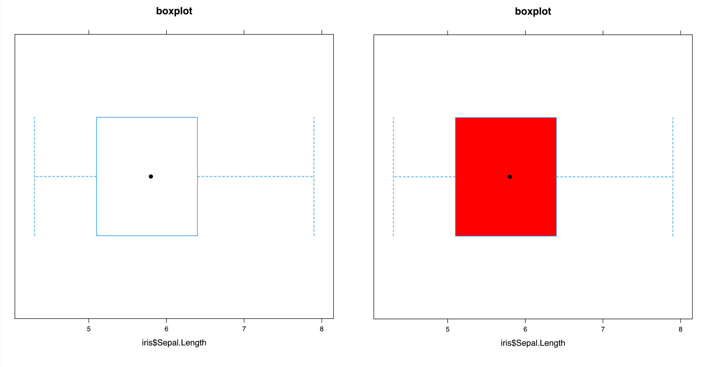
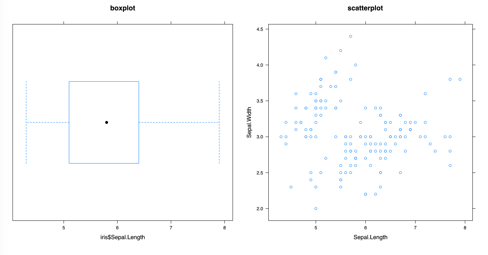
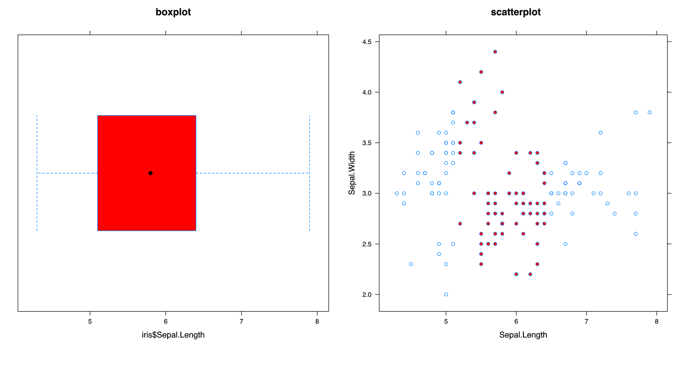
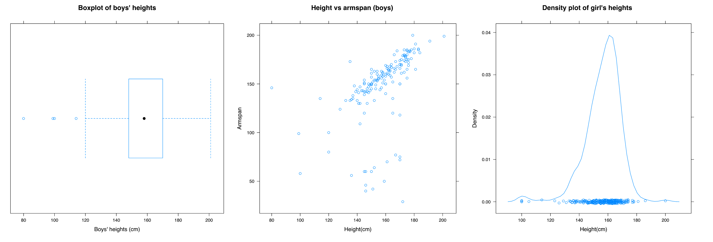
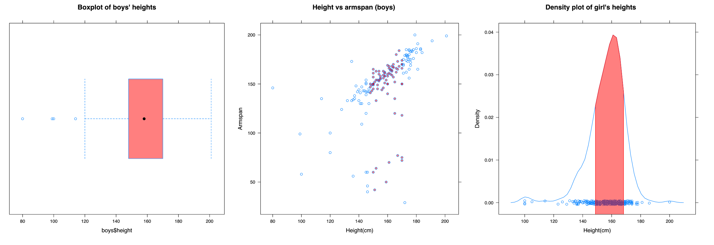
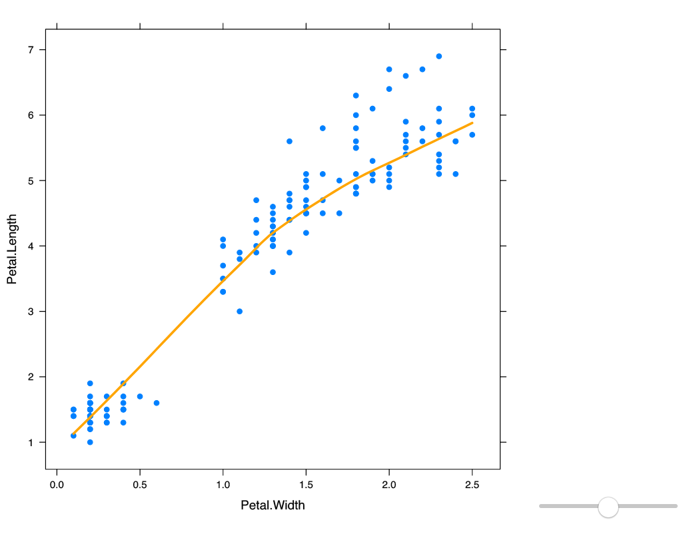
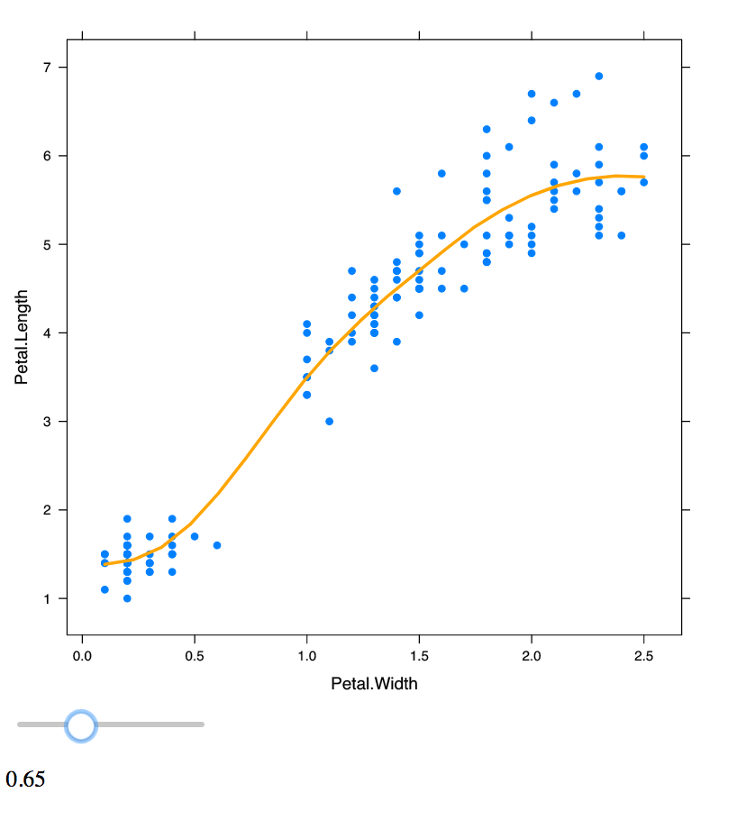
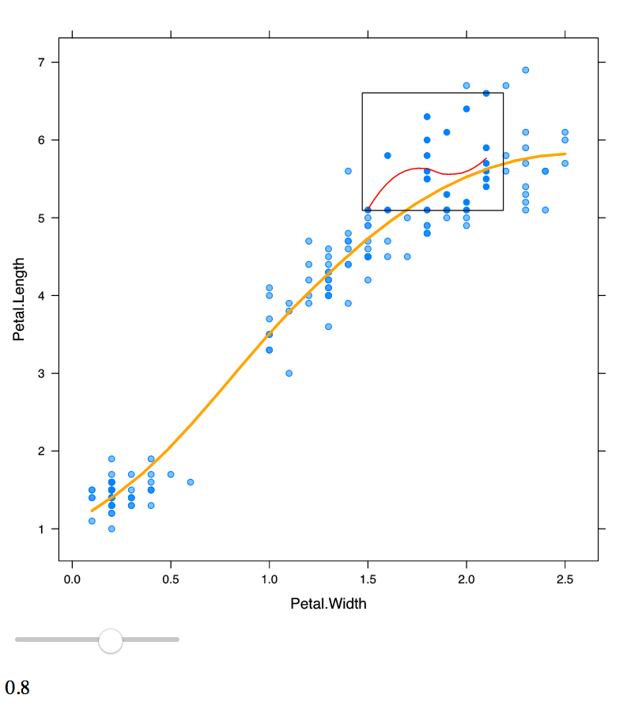
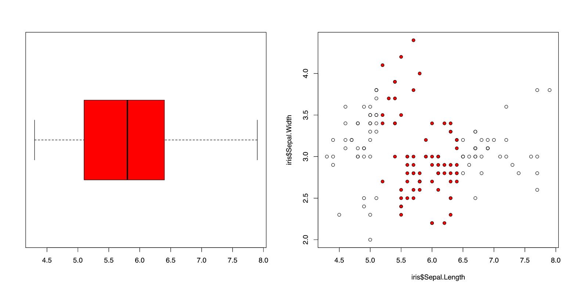
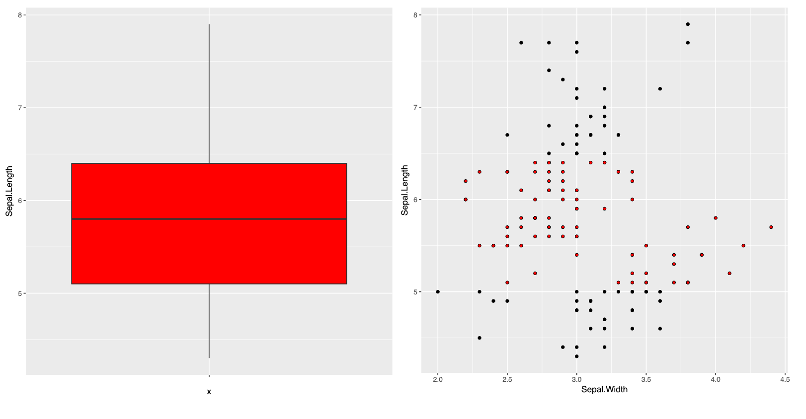

```{r global_options, include = FALSE}
knitr::opts_chunk$set(warning = FALSE,
                      message = FALSE,
                      fig.align = "center",
                      out.extra = "")
```

By using **gridSVG**, **DOM** and JavaScript, we can customise interactions onto plots. However, these are too specific and assume a lot of knowledge from the user. We need a way to provide interactions that can be easily customised and defined by the user with a much less steeper learning curve. This section discusses a potential solution using grid, **gridSVG** and DOM to drive web interactive graphics.

## The main idea using grid, gridSVG and DOM

In each of the previous examples, there is a certain pattern. In order to define a single interaction, it requires the need to know which SVG element to target, what type of interaction or event is to be attached to that element, and how to define what happens when an interaction occurs. This idea can be broken down into 5 simple steps:

  - Draw the plot or elements in R
  - Identify elements to interact with
  - Determine what kind of interaction is to be achieved
  - Attach and link interactions and events to targeted elements
  - Send interaction instructions and plot to the browser

```{r, echo = FALSE, fig.cap = "Figure 4.1: grid, gridSVG and DOM in the process"}
knitr::include_graphics('./fig/main-idea.svg')
```

The process above (Figure 4.1) can be implemented using grid, **gridSVG** and DOM.
We can use the relationship between grid and **gridSVG** elements explained in Chapter 3.1 to allow users to define and identify which elements to target. We can use DOM to attach interactions to certain elements and send these across to a web page. The reason for using DOM rather than shiny is that there are more complexities that work under the shiny framework including reactive programming, which is particularly difficult to grasp in detail. Because it is so low level, we can use DOM to create different types of interactions, but it is unreasonable for the majority of users as it requires some understanding of web technologies and takes too much effort. As seen in Figure 3.7, it takes roughly 40 lines of code to achieve a simple hover effect (with or without writing JavaScript), and about 200 lines of code to link a slider to a smoother (Figure 3.9).

We need a system that is more convenient for users, not too strenuous to code up, does not require too many pre-requisites, but is flexible enough to achieve different interactions. We have created the **interactr** package that attempts to prototype this idea. It acts as a convenience wrapper for defining interactions with **DOM**, **gridSVG** and **grid**. It aims to allow users to define their own interactions to plots in R without the need for a full understanding of the web technologies involved.

We have recreated some examples using **interactr** to demonstrate this idea. Many of the examples discussed below use functions that are found in this package.

## Examples

### A linked box plot

**Note: the following images in this section are static.**

The goal for this example is to link the interquartile range of the box plot to a scatter plot, followed by a density plot. When the user clicks on the box plot, it highlights the range of the box plot on the other respective plots.

We note that everything that will be done is coded in R so it requires no knowledge JavaScript or other web technologies from the user.

Our first step is to draw the box plot in R.

```{r}
library(interactr)
library(lattice)
bw <- bwplot(iris$Sepal.Length, main = "Sepal length", xlab = "Sepal length")
```

Here, we have stored the box plot into a variable called `bw`. To attach interactions, we need to identify what elements have been drawn. We can do that by listing the elements.

```{r, fig.cap = "Figure 4.2: Producing a box plot in R"}
listElements(bw)
box <- "plot_01.bwplot.box.polygon.panel.1.1"
```

This will print the plot and return a list of all the elements that make up the box plot in R. The user can identify which element to target to attach interactions. This is one of the disadvantages (further discussed in Section 5.2) of this process - the user must deduce which element to target through the names listed. In some cases, this is straightforward like in the example above, we suggest that the 'box' should refer to the box plot. We have identified the box that marks between the lower quartile and upper quartile.

Next, we can define a simple interaction. We want to achieve an interaction where when the user hovers over the box, it will turn red. In the case of a hover, we have defined it as a type of interaction to which we can specify the 'attributes' and styles of the box.

```{r, eval = FALSE}
interactions <- list(hover = styleHover(attrs = list(fill = "red",
                                                     fill.opacity = "1")))
```

Note that the interaction has only been defined but not linked to the targeted element (which is the box) yet.

```{r, eval = FALSE}
draw(bw, box, interactions, new.page = TRUE)
```
This line of code (the `draw` function) both links the interaction we defined before to the box element and sends the plot across to a new web page. We see that when the user hovers over the box, the box turns red as seen in Figure 4.2.

```{r, echo = FALSE, fig.cap = "Figure 4.2: Boxplot with a hover interaction"}

```

Before we move on to drawing the scatter plot, we need to make sure we identify the interquartile range of the box plot and extract any other information we may require from the plot before moving onto the next. This is one of the disadvantages of using this package which is further discussed in Section 5.2 when plots are separately drawn to the graphics device each time.

Here, we can return the range of the box plot and store it in a variable called `range`.

```{r, eval = FALSE}
range <- returnRange(box)
```

We now proceed to add a scatter plot by drawing the scatter plot, listing the elements and identifying the 'points', before sending it to the same web page.

```{r, eval = FALSE}
sp <- xyplot(Sepal.Width ~ Sepal.Length,
             data = iris,
             main = "Sepal Width ~ Sepal Length")
listElements(sp)
points <- "plot_01.xyplot.points.panel.1.1"
draw(sp) #by default, new.page = FALSE
```

We see that the box plot and the scatter plot we drew in R are now on the same web page (Figure 4.3).

```{r, echo = FALSE, fig.cap = "Figure 4.3: Box plot and scatter plot on the same web page"}

```

To highlight the points in the scatterplot that lie in the range of the box, the user can define the function as follows. We will determine the indices of the points that lie within the range of the box, and then pass that index through a function called `setPoints` to highlight these in red and group them together in a class called `selected`.

<a id="highlightPoints"> </a>

```{r, eval = FALSE}
highlightPoints <- function(ptr) {
  #identify indices of selected points
  index <- which(min(range) <= iris$Sepal.Length
                 & iris$Sepal.Length <= max(range))
  # set identified points to red
  setPoints(points,
            type = "index",
            value = index,
            attrs = list(fill = "red",
                         fill.opacity = "1",
                         class = "selected"))
}
```

This function can be easily modified by the user and requires them to make the connection between the data they are dealing with (in this case, the iris data).
As we have defined this interaction, we now need to define the event that will invoke this interaction before we can send it to the browser.

```{r, eval = FALSE}
boxClick <- list(onclick = 'highlightPoints')
addInteractions(box, boxClick)
```

We have inserted the function name to run when a 'click' is performed (line 1). Next in the second line of code, we have appended this interaction to the box element, so that when we click on the box, the points in the scatterplot that lie within that range should light up in red. This is shown in Figure 4.4.


```{r, echo = FALSE, fig.cap = "Figure 4.4: Click on box plot to light up points on scatter plot"}

```
**Click [here](http://104.236.190.93:3838/YuHan/link-box-lattice/) to view the example in Figure 4.4.**

This example can be further extended by linking the box plot to both a scatter plot and density plot. Here, we have taken the first 500 observations from a survey conducted with school children in 2009 [@census01] and wish to find out the density of girls who have the heights that lie within that interquartile range of the boys heights.

```{r, echo = FALSE, eval = FALSE}
# get dataset off web
census <- read.csv("http://new.censusatschool.org.nz/wp-content/uploads/2016/08/CaS2009_subset.csv",
         header = TRUE)

# subset the first 500 values
census <- census[1:500, ]

# separate girls and boys
boys <- census[census$gender == "male", ]
girls <- census[census$gender == "female", ]
```

First, we draw a box plot of boys heights and attach a hover effect to the box, similar to what was done previously. The range of the box is identified for further use.

```{r, eval = FALSE}
bw <- bwplot(boys$height, main = "Boxplot of boys' heights",
             xlab = "Boys' heights (cm)")
bw.elements <- listElements(bw, "boys_height")
box <- "boys_height.bwplot.box.polygon.panel.1.1"
interactions <- list(hover = styleHover(attrs = list(fill = "red",
                                                     fill.opacity = "0.5",
                                                     pointer.events = "all")))
draw(bw, box, interactions, new.page = TRUE)
range <- returnRange(box)
```

Next, we add the scatter plot between boys' heights and armspan to the page.

```{r, eval = FALSE}
sp <- xyplot(boys$armspan ~ boys$height,
             main = "Height vs armspan (boys)",
             xlab = "Height(cm)",
             ylab = "Armspan")
sp.elements <- listElements(sp, "sp_bheight")
points <- "sp_bheight.xyplot.points.panel.1.1"
draw(sp)
```

The next line of code adds the density plot of girls heights. Note that no interactions have been defined yet.

```{r, eval = FALSE}

dplot <- densityplot(~girls$height,
                     main="Density plot of girl's heights",
                     xlab="Height(cm)")
d.elements <- listElements(dplot, "girls_height")
dlist <- list(points = "girls_height.density.points.panel.1.1",
              lines = "girls_height.density.lines.panel.1.1")
draw(dplot)

```

```{r, echo = FALSE, fig.cap = "Figure 4.5: All three plots on the same web page"}

```
Figure 4.5 shows all three plots on the same web page.

In order to highlight a certain region of the density plot, we need to add a new element to the page. This can be done using the `addPolygon` function. Ideally, it should be added to the same group as where the density lines are located. We can use the `findPanel` function to identify the correct viewport to attach to.

```{r, eval = FALSE}
# add invisible polygon to the page:
panel <- findPanel(dlist$lines)
addPolygon("highlightRegion", panel, class = "highlight",
           attrs = list(fill = "red",
                        stroke = "red",
                        stroke.opacity = "1",
                        fill.opacity= "0.5"))

```

This polygon will remain invisible to the page as we have not defined the coordinates of the region. We only want this to appear when the user has clicked on the box plot.

Next, we write a function that defines what happens after the box plot is clicked. We identify which the coordinates of the density line lie within the range of the box plot. This can be used to define the points of the region that we wish to highlight.
We can also highlight the points in the scatter plot in the same way as we have done in the previous example.

```{r, eval = FALSE}
highlightRange <- function(ptr) {

  coords <- returnRange(dlist$lines)
  index <- which(min(range) <= coords$x & coords$x <= max(range))
  xval <- coords$x[index]
  yval <- coords$y[index]

  # add start and end points for drawing the region to be highlighted
  xval <- c(xval[1], xval, xval[length(xval)])
  yval <- c(-1, yval, -1)

  pt <- convertXY(xval, yval, panel)

  #set points on added polygon
  setPoints("highlightRegion", type = "coords", value = pt)

  # highlight points on scatter plot, remove missing values
  index <- which(min(range) <= boys$height  
                 & boys$height <= max(range)
                 & !is.na(boys$armspan))

  # set points that will highlight according to index
  setPoints(points,
            type = "index",
            value = index,
            attrs = list(fill = "red",
                         fill.opacity = "0.5",
                         class = "selected"))

}

```

Finally, we define and attach our interactions to the page.

```{r, eval = FALSE}
boxClick <- list(onclick = "highlightRange")
addInteractions(box, boxClick)
```

When the user now clicks on the box plot, it lights up the points and the density that lie within that range as seen in Figure 4.6.

```{r, echo = FALSE, fig.cap = "Figure 4.6: A single click on the box plot links the density and scatterplot together"}

```

**Click [here](http://104.236.190.93:3838/YuHan/box-density/) to view the example demonstrated in Figure 4.6.**

### Changing the degree of smoothing of a trend line

Another example that can be done with **interactr** is driving an interaction using a slider. The slider controls the smoothing of the trend curve. We do not want to redraw the scatter plot when the smoothing settings change.

Here, it becomes more complex as it requires information to be sent and queried back and forth between R and the browser.

Once again, we begin by drawing a plot.
```{r, eval = FALSE}
iris.plot <- xyplot(Petal.Length ~ Petal.Width,
                    data = iris,
                    pch = 19,
                    type = c("p", "smooth"),
                    col.line = "orange", lwd = 3)
#list elements and print plot
listElements(iris.plot)
#send plot to browser
draw(iris.plot, new.page = TRUE)
```

Next, we add a slider to the page. This has not been linked up to any elements yet (Figure 4.7).

```{r, eval = FALSE}
#add slider to page:
addSlider("slider", min = 0.5, max = 1, step = 0.05)
```

```{r, echo = FALSE, fig.cap = "Figure 4.7: Plot with slider"}

```

The user can write a function with the argument `value` to define what happens when the slider moves. This passes the value of the slider from the web page back to R. Here, we want to use the value to control the span of the trend line. To translate the new x and y values of the points that define the drawn trend line, we need to convert them into SVG co-ordinates (as mentioned before in Chapter 3.1) before updating these points.

```{r}
controlTrendline <- function(value) {
  showValue(value) # to show value of the slider
  value <- as.numeric(value)

  #user defines what to do next (here, recalculates x and y)
  x <- seq(min(iris$Petal.Width), max(iris$Petal.Width), length = 20)
  lo <- loess(Petal.Length~Petal.Width, data = iris, span = value)
  y <- predict(lo, x)

  #convert coordinates and set points
  panel <- findPanel('plot_01.xyplot.points.panel.1.1')
  pt <- convertXY(x, y, panel)
  setPoints("plot_01.loess.lines.panel.1.1", type = "coords", value = pt)
}
```

Once this is done, we need to pass this function to retrieve the value of the slider as it moves. To do this, have a special function called `sliderCallback`. This redefines and creates the entire function that is now called `sliderValue`.

```{r, eval = FALSE}
# pass defined function through sliderCallback to pass slider value correctly
sliderValue <- sliderCallback(controlTrendline)
```
Finally, we can link the `sliderValue` function back to the slider such that when the slider moves, the trend line will be updated based upon the value of the slider as seen in Figure 4.8.

```{r, eval = FALSE}
int <- list(oninput = "sliderValue")
addInteractions("slider", int)
```

```{r, echo = FALSE, fig.cap = "Figure 4.8: Plot with slider that controls the smoothness of the trend line"}

```

Another feature that the user may want to achieve is to be able to select a set of points and compute a trend line using those specific points. To be able to do this, we need to add a new element to the page to represent this special trend line. This can be done using the `addLine` function. Here, we have added it to the same group where these points are.

```{r, eval = FALSE}
pointsPanel <- findPanel("plot_01.xyplot.points.panel.1.1")
addLine("newSmooth", pointsPanel, class = "hello", list(stroke = "red",
                                                  stroke.width = "1",
                                                  fill = "none"))
```

Note that this appears to be hidden on the page, as the points of this line have not been defined yet.
Next, a new function needs to be defined to be able to compute this new smoother.

```{r, eval = FALSE}
#create new smoother:
createSmooth  = function(index) {
  #this returns the indices of the points selected
  index <- as.numeric(unlist(strsplit(index, ",")))
  #filter selected points:
  if (length(index) > 20) {
    selected <- iris[index, ]
    x <- seq(min(selected$Petal.Width), max(selected$Petal.Width), length = 20)
    lo <<- loess(Petal.Length ~Petal.Width, data = selected, span = 1)
    y <- predict(lo, x)
    #convert co-ordinates:
    pt <- convertXY(x, y, pointsPanel)
  } else {
    pt <- ""
  }
  setPoints("newSmooth", type = "coords", value = pt)
}

```

Because the index of the points need to be returned from the browser back to R, we use `boxCallback` to help us link these functions together. As linking a selection box is a special type of interaction, we can pass our defined function through to the `addSelectionBox` function which adds on the selection box and links it together to compute the new smoother.

```{r, eval = FALSE}
#link callback functions together to pass index values to function
boxIndex = boxCallback(createSmooth)
addSelectionBox(plotNum = 1, el = "plot_01.xyplot.points.panel.1.1", f = "boxIndex")
```

```{r, echo = FALSE, fig.cap = "Figure 4.9: Plot that has a selection box feature that draws a separate smoother"}

```
**Click [here](http://104.236.190.93:3838/YuHan/link-trendline/) to view the entire example in Figure 4.9, which controls a trend line with a slider and a drag-box to create a new smoother.**

The user now can draw a selection box over a set of points, and a new smoother should render on the page based upon these points (shown in Figure 4.9).

The notion of having special functions is required when there is a need for querying the browser for more information (such as the value of the slider, or the points selected on a page). In the box plot example in Section 4.2.1, the information was stored back in R which did not require a special callback function. These types of interactions are more complex to handle.

## Compatibility with other graphics systems

A useful feature of interactr is its compatibility with other R graphing systems including **lattice**, **graphics** (also known as base R plots), and **ggplot2**.

Before we begin, we will briefly mention the two different graphics systems in R. One is known as the **graphics**, the other known as **grid** . A major difference between the two systems is that **grid** is not made to draw complete plots by a single function [@rgraphics01]. Rather, it is seen as a lower level graphics tool that has been used to build successful higher level plotting packages, including **lattice** and **ggplot2**. Packages that are built on top of the **grid** system can be accessible to the other **grid** tools available, including **gridSVG** and **grImport** [@rgraphics01]. Likewise, there are other tools that are only compatible with the **graphics** system. There are many other packages that are built on top of these two major systems that make up the graphics that we can produce in R.

The examples discussed so far with **interactr** have been done with **lattice** plots. However, it is possible to achieve the same with other plotting systems. To demonstrate, we have taken the box plot example in Figure 4.5 and replicated it using **graphics** and **ggplot2**.

### graphics plots

As briefly mentioned in Chapter 3, in order to convert SVG objects using **gridSVG** the objects must be **grid** objects. In the case of graphics plots, we cannot directly call **gridSVG** to convert it into an SVG. A simple solution to this is to use the **gridGraphics** package [@gridGra01], which acts as a translator by converting graphics plots into grid plots with a consistent naming scheme. The `grid.echo()` function achieves this.

```{r, eval = FALSE}
library(grid)
plot(1:10, 1:10)
grid.ls()
gridGraphics::grid.echo()
grid.ls()
```
```{r, echo = FALSE}
library(grid)
plot(1:10, 1:10)
grid.ls()
gridGraphics::grid.echo()
grid.ls()
```
Figure 4.10: An example of a graphics plot that is converted into a grid plot using gridGraphics

The code above produces a graphics plot that has been converted to a grid plot (as seen in Figure 4.10). To check this, we have called `grid.ls()` to check whether is a grid object. In the first call, it returns nothing because it is not a grid object. Once we call `grid.echo()`, `grid.ls()` returns a list of elements that make up the plot.

Another problem is that when we plot or try save it into a variable, it does not plot to the graphics device. To solve this, we can use `recordPlot` to record the plot that has been drawn to further process it [@record01].

The only change that we need to do is run an extra `recordPlot` command before we call `listElements`.

Once again, we begin by drawing the plot. We then record the plot before listing its elements. This will automatically convert the plot using `grid.echo()`.

```{r, eval = FALSE}
boxplot(iris$Sepal.Length, horizontal = TRUE)
pl <- recordPlot()
listElements(pl)
```

Next, the same process occurs. We see that the code is very similar to what was done previously with `lattice`. We can use the same [`highlightPoints`](#highlightPoints) function defined back in the `lattice` example.

```{r, eval = FALSE}
# identify box in box plot and send the plot to the browser
box = "graphics-plot-1-polygon-1"
interactions <- list(hover = styleHover(attrs = list(fill = "red",
                                                     fill.opacity = "1")))
draw(pl, box, interactions, new.page = TRUE)
range <- returnRange(box)

# plot a graphics scatter plot
plot(iris$Sepal.Length, iris$Sepal.Width)
sp <- recordPlot()
listElements(sp)
draw(sp)

#add interactions
points <- 'graphics-plot-1-points-1'
boxClick <- list(onclick = "highlightPoints")
addInteractions(box, boxClick)
```

```{r, echo = FALSE, fig.cap = "Figure 4.11: box plot example replicated using a graphics plot"}

```
**Click [here](http://104.236.190.93:3838/YuHan/link-box-graphics/) to view the example shown in Figure 4.11.**

The same interaction has been achieved in Figure 4.11. This shows that there is potential for customising interactions onto graphics plots. The process is the same, except for an additional step to convert a **graphics** plot into a **grid** type plot.

### ggplot2

**ggplot2** [@ggplot01] is a popular plotting system in R based upon the "Grammar of Graphics". It is built upon the **grid** graphics system, which makes it compatible with **gridSVG**.

```{r, eval = FALSE}
library(ggplot2)
p <- ggplot(data = iris, aes(x = "", y = Sepal.Length)) + geom_boxplot()
p.elements <- listElements(p)
box <- findElement("geom_polygon.polygon")
interactions <- list(hover = styleHover(attrs = list(fill = "red",
                                                     fill.opacity = "1",
                                                     pointer.events = "all")))
draw(p, box, interactions, new.page = TRUE)

```

However, because it works on a completely different co-ordinates system, we cannot simply use the `returnRange` function to define the range of the box.

The native coordinates given by `grid` do not return that data coordinates of the ggplot. A simple solution to this is that the information about the plot can be extracted from `ggplot_build`. Below, we have manually identified the range of the box.

```{r, eval = FALSE}
# find the range of the box:
boxData <- ggplot_build(p)$data[[1]]
# for a box plot - IQR: lower, upper
range <- c(boxData$lower, boxData$upper)
```

Next, we add the scatterplot to the page.

```{r,eval = FALSE}
sp <- ggplot(data = iris, aes(x = Sepal.Width, y =Sepal.Length)) + geom_point()
sp.elements <- listElements(sp)
draw(sp)
```

The difference is the naming of these grid elements do not have a clear structure in ggplot2. To locate the points on the plot, we can use `findElement` to return the element corresponding to these points.

```{r, eval = FALSE}
points <- findElement("geom_point.point")
```

Next, we can use the same function [`highlightPoints`](#highlightPoints) defined before sending these interactions to the browser  (Figure 12).

```{r, eval = FALSE}
#using highlightPoints defined previously in 3.1
boxClick <- list(onclick = "highlightPoints")
addInteractions(box, boxClick)
```

```{r, echo = FALSE, fig.cap = "Figure 4.12: box plot example replicated using ggplot2"}

```
**Click [here](http://104.236.190.93:3838/YuHan/link-box-ggplot2/) to view the example shown in Figure 4.12.**

This demonstrates that there is a possible way of achieving interactions with **ggplot2** and that there is potential for **interactr** to plug into different R plotting systems. Consequently, when we assess the compatibility of different plotting systems, we need to take into account of possible detours that could occur. Because this is a simplistic example, it may become more complex when we try to achieve more sophisticated interactions.

The **interactr** package acts as a proof-of-concept and a starting point for what aims to be a general solution for adding simple interactions to plots generated in R. There is potential in plugging into different plotting systems, however it depends on how compatible these systems are with the underlying tools of the **interactr** package. But the most commonly used systems are covered by our examples. The process is based upon defining what you want to draw in R, identifying elements drawn, and defining specific interactions to attach to certain elements drawn that can be viewed in a web browser. Next, we discuss the limitations and future directions of using this process as a way of creating web interactive graphics.

## References {-}
