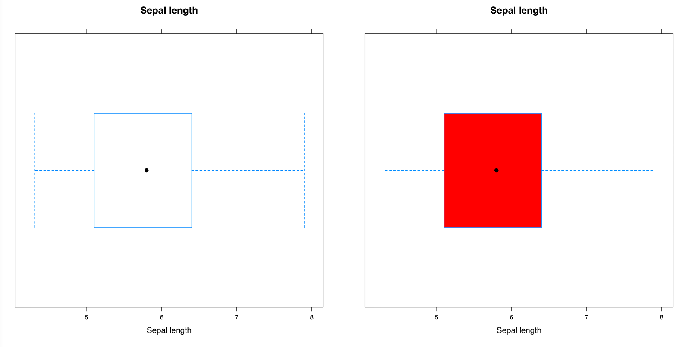

---
output:
  html_document:
    toc: true
    toc_depth: 3
    toc_float: true
    pandoc_args: [
      "--number-sections",
      "--number-offset=3"
    ]
---

<br />

# Designing a more flexible way of producing simple interactions

By using gridSVG, DOM and JavaScript, we can customise interactions onto plots. However, these are too specific and assumes a lot of knowledge from the user. We need a way to provide general interactions that can be easily customised and defined by the user without a steep learning curve.

## The main idea

In each of the previous examples defined, they all have a certain pattern. In order to define a single interaction, it requires the need to know which SVG element to target, what type of interaction or event is to be attached, and how to define what happens when an interaction occurs. This idea can be broken down into 5 simple steps:

  - Draw the plot in R
  - Identify elements to interact with
  - Define interactions and process, which elements to target
  - Attach interactions and define events
  - Send defined interactions and plot to the browser

*Figure 4.1: Diagram illustrating the basic process of creating interactions*

To demonstrate this idea, we have created the `interactr` package which builds upon three main packages: DOM, grid and gridSVG. It is designed to allow users to define their own interactions to plots in R, without a full understanding of the web and these lower level tools.

*TODO: some key points to note, but should these be mentioned in chapter 3?*

To put the idea into practice, the following examples have been replicated using the `interactr` package.

## Examples

### Linking box plots

The goal in this example is to link the interquartile range of the box plot to a scatter plot, followed by a density plot. When the user clicks on the box plot, it highlights the range of the box plot on the other respective plots.

Our first step is to draw the box plot in R.
```{r, eval = FALSE}
library(lattice)
bw <- bwplot(iris$Sepal.Length, main = "boxplot")
```

Here, we have stored the boxplot object into a variable called 'bw'. In order to attach interactions, we need to identify what elements have been drawn. We can do that easily by listing the elements.

```{r, eval = FALSE}
listElements(bw)
```

This will print and return a list of all the elements that make up the box plot in R. Here, the user can identify which element to target and refer to in order to attach interactions.

Next, we can define a simple interaction. We want to achieve an interaction where when the user hovers over the box, it will turn red. In the case of a 'hover', we have defined it as a type of interaction to which we can specify the 'attributes' and styles of the box (here, we have made it so that it turns red when hovered).

```{r, eval = FALSE}
box <- "plot_01.bwplot.box.polygon.panel.1.1"
interactions <- list(hover = styleHover(attrs = list(fill = "red",
                                                     fill.opacity = "1")))
```

Note that the interaction has only been defined, but not attached yet.
Finally, in order to view our plot in the web browser, we send the plot and our interactions.

```{r, eval = FALSE}
draw(bw, box, interactions, new.page = TRUE)
```

In this step, we have sent the plot we drew in R to a new web page. We can also attach an interaction to the `box` element we identified earlier to attach the hover interaction to. On the page (Figure 4.2), we see that when the user hovers over the box, the box turns red.



Before we move on to drawing the scatter plot, we need to make sure we identify the interquartile range of the box plot and extract any other information we may require from the plot before moving onto the next.

This is one of the disadvantages of this process - if there is anything

Here, we can return the range of the box plot and store it in a variable called `range`.

```{r, eval = FALSE}
range <- returnRange(box)
```

We proceed to add a scatter plot by drawing the scatter plot, listing the elements and identifying the 'points', before sending it to the same web page.

```{r, eval = FALSE}
sp <- xyplot(Sepal.Width ~ Sepal.Length,
             data = iris,
             main = "scatterplot")
listElements(sp)
points <- "plot_01.xyplot.points.panel.1.1"
draw(sp) #by default, new.page = FALSE
```

Here, we see that the box plot and the scatter plot we drew in R are now on the same web page (Figure 4.3).


To highlight the points in the scatterplot that lie in the range of the box, the user can define the function as follows. We can determine the index of the points that lie within the range of the box, and then pass that index through a function called `setPoints` to highlight these in red and group them together in a class called `selected`.

```{r, eval = FALSE}
highlightPoints <- function(ptr) {
  #identify index
  index <- which(min(range) <= iris$Sepal.Length
                 & iris$Sepal.Length <= max(range))
  #identify points and set them to red
  setPoints(points,
            type = "index",
            value = index,
            attrs = list(fill = "red",
                         fill.opacity = "1",
                         class = "selected"))
}
```

This function can be easily modified by the user and requires them to make the connection between the data they are dealing with (in this case, the iris data).
As we have defined this interaction, we need to define the event to call this interaction to before we can send it to the browser.

```{r, eval = FALSE}
boxClick <- list(onclick = 'highlightPoints')
addInteractions(box, boxClick)
```

Here, we insert the function name to run when a 'click' is done. Next, we append this defined interaction to the box element, so that when we click on the box, the points in the scatterplot that lie within that range should light up in red. This is shown in Figure 4.4.


*could insert a gif/video here*

This example can be further extended by linking the box plot to both a scatter plot and density plot. Here, we have taken some census data and wish to find out the density of girls who have the heights that lie within that interquartile range of the boys heights.

We begin by drawing the box plot of boys heights.

```{r, eval = FALSE}
#get dataset off web:
census <- read.csv("http://new.censusatschool.org.nz/wp-content/uploads/2016/08/CaS2009_subset.csv",
         header = TRUE)

#subset the first 500 values... since gridSVG can't handle all 15000 values on the scatter plot:
census <- census[1:500, ]

# separate girls and boys:
boys <- census[census$gender == "male", ]
girls <- census[census$gender == "female", ]

bw <- bwplot(boys$height, main = "Boxplot of boys' heights")
bw.elements <- listElements(bw, "boys_height")
box <- "boys_height.bwplot.box.polygon.panel.1.1"
interactions <- list(hover = styleHover(attrs = list(fill = "red",
                                                     fill.opacity = "0.5",
                                                     pointer.events = "all")))
draw(bw, box, interactions, new.page = TRUE)
range <- returnRange(box)
```

Next, we add the scatterplot to the page.

```{r, eval = FALSE}
sp <- xyplot(boys$armspan ~ boys$height,
             main = "Height vs armspan (boys)",
             xlab = "Height(cm)",
             ylab = "Armspan")
sp.elements <- listElements(sp, "sp_bheight")
points <- "sp_bheight.xyplot.points.panel.1.1"
draw(sp)
```

Then, we add the density plot of girls heights.

```{r, eval = FALSE}

dplot <- densityplot(~girls$height,
                     main="Density plot of girl's heights",
                     xlab="Height(cm)")
d.elements <- listElements(dplot, "girls_height")
dlist <- list(points = "girls_height.density.points.panel.1.1",
              lines = "girls_height.density.lines.panel.1.1")
draw(dplot)

```


In order to highlight a certain region of the density plot, we need to add a new element to the page. This can be done using the `addPolygon` function. Ideally, it should be added to the same group as where the density lines are located. We can use the `findPanel` function to identify the correct viewport to attach to.

```{r, eval = FALSE}
# add invisible polygon to the page:
panel <- findPanel(dlist$lines)
addPolygon("highlightRegion", panel, class = "highlight",
           attrs = list(fill = "red",
                        stroke = "red",
                        stroke.opacity = "1",
                        fill.opacity= "0.5"))

```

Note that this will be invisible to the page as we have not defined the coordinates of the region. We only want this to appear when the user has clicked on the box plot.

Here we write a function that defines what happens after the box plot is clicked. We identify which the coordinates of the density line lie within the range of the box plot. This can be used to define the points of the region that we wish to highlight.
We can also highlight the points in the scatter plot in the same way as we have done in the previous example.

```{r, eval = FALSE}
highlightRange <- function(ptr) {

  coords <- returnRange(dlist$lines)
  index <- which(min(range) <= coords$x & coords$x <= max(range))
  xval <- coords$x[index]
  yval <- coords$y[index]

  # add start and end:
  xval <- c(xval[1], xval, xval[length(xval)])
  yval <- c(-1, yval, -1)

  pt <- convertXY(xval, yval, panel)

  #set points on added polygon
  setPoints("highlightRegion", type = "coords", value = pt)

  # highlight points in scatter plot:
  index <- which(min(range) <= boys$height  
                 & boys$height <= max(range)
                 & !is.na(boys$armspan))
  # note that if armspans are missing,
  # then it will return 'element is undefined',
  # requires !is.na(boys$armspan) to remove missing values
  setPoints(points,
            type = "index",
            value = index,
            attrs = list(fill = "red",
                         fill.opacity = "0.5",
                         class = "selected"))

}

```

Finally, we define and attach our interactions to the page.

```{r, eval = FALSE}
boxClick <- list(onclick = "highlightRange")
addInteractions(box, boxClick)
```

When the user now clicks on the box plot, it lights up the points and the density that lie within that range as seen in Figure 4.6.


### Changing a trendline

Another example that can be done is driving an off-plot interaction with a slider. The slider controls the smoothing of the trend line.

Here, it becomes more complex as it requires information to be sent and queried in both ways: from R to the browser and from the browser back to R.

Once again, we begin by drawing a plot.
```{r, eval = FALSE}
iris.plot <- xyplot(Petal.Length~Petal.Width,
                    data = iris,
                    pch = 19,
                    type = c("p", "smooth"),
                    col.line = "orange", lwd = 3)
#list elements and print plot
listElements(iris.plot)
#send plot to browser
draw(iris.plot, new.page = TRUE)
```
Next, we add a slider to the page. This has not been linked up to any elements yet.

```{r, eval = FALSE}
#add slider to page:
addSlider("slider", min = 0.5, max = 1, step = 0.05)
```


To define what happens when the slider moves, the user can write a function with the argument `value`. This passes the value of the slider (as a character) from the web page back to R. Here, we can use the value to control the span of the trend line. To translate the new x and y values of the trend line, we need to convert them into the right scale before updating these points.

```{r}
controlTrendline <- function(value) {
  showValue(value) #to show value of the slider
  value <- as.numeric(value)

  #user defines what to do next: (here, recalculates x and y)
  x <- seq(min(iris$Petal.Width), max(iris$Petal.Width), length = 20)
  lo <- loess(Petal.Length~Petal.Width, data = iris, span = value)
  y <- predict(lo, x)

  #convert coordinates and set points:
  panel <- findPanel('plot_01.xyplot.points.panel.1.1')
  pt <- convertXY(x, y, panel)
  setPoints("plot_01.loess.lines.panel.1.1", type = "coords", value = pt)
}
```
Once this is done, we need to pass this function to retrieve the value of the slider as it moves. Here, we have a special function called `sliderCallback` for this. This redefines and creates the entire function that is now called `sliderValue`.

```{r, eval = FALSE}
#pass defined function through sliderCallback to pass slider value correctly
sliderValue <- sliderCallback(controlTrendline)
```
Finally, we can link this certain interaction back to the slider, such that when the slider moves, the trend line will be updated based upon the value of the slider as seen in Figure 4.7.

```{r, eval = FALSE}
int <- list(oninput = "sliderValue")
addInteractions("slider", int)
```


Another feature that the user may want to achieve is to be able to select a set of points and compute a trend line using those specific points. To be able to do this, we need to add a new element to the page to represent this special trend line. This can be done using the `addLine` function. Here, we have added it to the same group where these points are.

```{r, eval = FALSE}
panel <- findPanel("plot_01.xyplot.points.panel.1.1")
addLine("newSmooth", panel, class = "hello", list(stroke = "red",
                                                  stroke.width = "1",
                                                  fill = "none"))
```
Note that this appears to be hidden on the page, as the points of this line have not been defined yet.

Next, the function needs to be defined to be able to compute this new smoother.

```{r, eval = FALSE}
#create new smoother:
createSmooth  = function(index) {
  #this returns the indices of the points selected
  # could use DOM 0.5 and pass JSON through to avoid this step...
  index <- as.numeric(unlist(strsplit(index, ",")))
  #filter selected points:
  if (length(index) > 20) {
    selected <- iris[index, ]
    x <- seq(min(selected$Petal.Width), max(selected$Petal.Width), length = 20)
    lo <<- loess(Petal.Length ~Petal.Width, data = selected, span = 1)
    y <- predict(lo, x)
    #convert co-ordinates:
    pt <- convertXY(x, y, panel)
  } else {
    pt <- ""
  }
  setPoints("newSmooth", type = "coords", value = pt)
}

```

Because the index of the points need to be returned from the browser back to R, we use `boxCallback` to help us link these functions together.
As linking a selection box is a special kind of interaction, we can pass our defined function through to the `addSelectionBox` function which adds on the selection box and links the defined interactions together to compute the new smoother.

```{r, eval = FALSE}
#link callback functions together to pass index values to function
boxIndex = boxCallback(createSmooth)
addSelectionBox(plotNum = 1, el = "plot_01.xyplot.points.panel.1.1", f = "boxIndex")
```


On the page, the user now can draw a selection box over a set of points, and a new smoother should render on the page based upon these points. The notion of having special functions are required when there is a need for querying the browser for more information (such as the value of the slider, or the points selected on a page). In our previous example, that information was stored back in R which did not require a special callback function. These types of interactions are more complex to handle.

## Compatibility with other graphics systems

A possibility of extending this idea further is the compability with other R graphing systems including **lattice**, **graphics**, and **ggplot2**. As we have seen above, many of these examples are done with **lattice** plots. However, it is possible to achieve the same with different graphing systems. To demonstrate, we have taken the box plot example in Figure 4.2 and replicated it in graphics and ggplot2.

### Using graphics plots

As briefly mentioned in Chapter 3, in order to convert SVG objects using gridSVG the objects must be grid objects. In the case of graphics plots, we cannot directly call gridSVG to convert it into an SVG. A simple solution to this is to use the **gridGraphics** package, which acts as a translator by converting graphics plots into grid plots with a consistent naming scheme. The `grid.echo()` function achieves this.

```{r, eval = FALSE}
library(grid)
plot(1:10, 1:10)
grid.ls()
gridGraphics::grid.echo()
grid.ls()
```
```{r, echo = FALSE}
library(grid)
plot(1:10, 1:10)
grid.ls()
gridGraphics::grid.echo()
grid.ls()
```
Figure 4.9: An example of a graphics plot that is converted into a grid plot using gridGraphics

The code above produces a graphics plot that has been converted to a grid plot (as seen in Figure 4.9). To check this, we have called `grid.ls()` to check whether is a grid object. In the first call, it returns nothing because it is not a grid object. Once we call `grid.echo()`, `grid.ls()` returns a list of elements that make up the plot.

Another problem that arises is that when we plot or try save it into a variable, it does not plot to the graphics device. To solve this, we can use `recordPlot` to record the plot that has been drawn to further process it.

The only change that we need to do is run an extra `recordPlot` command before we call `listElements`.

Once again, we begin by drawing the plot. We then record the plot before listing its elements. This will automatically convert the plot using `grid.echo()`.
```{r, eval = FALSE}
boxplot(iris$Sepal.Length, horizontal = TRUE)
pl <- recordPlot()
listElements(pl)
```

Next, the same process occurs. We see that the code is very similar to what was done previously with `lattice`.

```{r, eval = FALSE}
box = "graphics-plot-1-polygon-1"
interactions <- list(hover = styleHover(attrs = list(fill = "red",
                                                     fill.opacity = "1")))
draw(pl, box, interactions, new.page = TRUE)
range <- returnRange(box)

# plot a graphics scatter plot
plot(iris$Sepal.Length, iris$Sepal.Width)
sp <- recordPlot()
listElements(sp)
draw(sp)

#add interactions
points <- 'graphics-plot-1-points-1'
highlightPoints <- function(ptr) {
  #find the index of points that lie within the range of the box
  index <- which(min(range) <= iris$Sepal.Length
                 & iris$Sepal.Length <= max(range))
  setPoints(points,
            type = "index",
            value = index,
            attrs = list(fill = "red",
                         fill.opacity = "1",
                         class = "selected"))
}

boxClick <- list(onclick = "highlightPoints")
addInteractions(box, boxClick)
```


This shows that there is potential for customising interactions onto graphics plots. The process is the same, except due to the nature of the graphics plot not being a 'grid' plot.

### Using ggplot2

**ggplot2** (Wickham et al, 2017) is a popular plotting system in R based upon the "Grammar of Graphics". It is built upon the `grid` graphics system, which makes it compatible with gridSVG.

```{r, eval = FALSE}
library(ggplot2)
p <- ggplot(data = iris, aes(x = "", y = Sepal.Length)) + geom_boxplot()
p.elements <- listElements(p)
box <- findElement("geom_polygon.polygon")
interactions <- list(hover = styleHover(attrs = list(fill = "red",
                                                     fill.opacity = "1",
                                                     pointer.events = "all")))
draw(p, box, interactions, new.page = TRUE)

```

However, because it works on a completely different co-ordinates system, we cannot simply use the `returnRange` function to define the range of the box.

The native coordinates given by `grid` do not return that data coordinates of the ggplot. A simple solution to this is that the information about the plot can be extracted from `ggplot_build`. Below, we have identified the range of the box manually.

```{r, eval = FALSE}
#find the range of the box:
boxData <- ggplot_build(p)$data[[1]]
#for a box plot - IQR: lower, upper
range <- c(boxData$lower, boxData$upper)
```

Next, we add the scatterplot to the page, define our interactions before sending it to the browser.

```{r,eval = FALSE}
sp <- ggplot(data = iris, aes(x = Sepal.Width, y =Sepal.Length)) + geom_point()
sp.elements <- listElements(sp)
draw(sp)
points <- findElement("geom_point.point")

highlightPoints <- function(ptr) {
  #find the index of points that lie within the range of the box
  index <- which(min(range) <= iris$Sepal.Length
                 & iris$Sepal.Length <= max(range))
  setPoints(points,
            type = "index",
            value = index,
            attrs = list(fill = "red",
                         fill.opacity = "1",
                         class = "selected"))
}

boxClick <- list(onclick = "highlightPoints")
addInteractions(box, boxClick)
```


Note that the only difference are the tags for how each element is defined. Because ggplot2 does not have a consistent naming scheme like **lattice** we can use the `findElement` function to allow the user to easily find which element they want to refer to.

This demonstrates that there is a possible way of achieving interactions with ggplot2 and there is potential for the **interactr** to plug into different R plotting systems. Consequently it also means that when we assess the compatibility of different plotting systems, we need to take into account of possible detours that could occur. Because this is a simplistic example, it may become more complex when we try to achieve more sophisticated interactions.

The **interactr** package acts as a proof-of-concept that aims to be a general solution for adding simple interactions to plots generated in R. There is potential in plugging into different plotting systems, however it depends on how compatible these systems are with the underlying tools of the **interactr** package. It is based upon a very simple process of defining what you want to draw in R, identifying elements drawn, and defining specific interactions to attach to certain elements drawn that can be viewed in a web browser.
