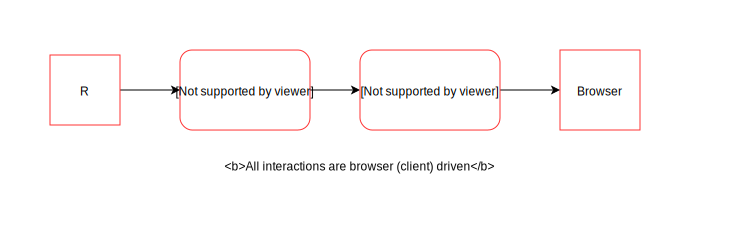

```{r, include = FALSE}
income <- read.csv('~/Desktop/datasets/nzincome.csv', header = TRUE)
```

## The goal

> ### Investigate ways of producing web interactive plots in R, and come up with a possible solution that could be used with iNZight.

--

- Briefly introduce some tools for creating web interactive visualisations and
  how they work

- realise that many of these tools are great for certain interactions, but difficult
and not designed to be extended further

- introduce a more easier and flexible solution for turning static R plots
into interactive ones (interactr)
---

## Interactive graphics

### What is interactive graphics?
> "querying, selection and linking, and varying plot characteristics"
- Theus, Unwin, Hoffmann(2006)

--

### Why do we need it?
- exploratory data analysis, get key insights faster
--

### Why the web?
- accessible + portable
- avoid installation issues and device compatibility
- A good platform for displaying interactive graphics

???
Querying involves finding out more about features that the user may be interested in, selection and linking involves subsetting a certain group and linking to different displays of the same data set, while varying plot characteristics involve changing parts of the plot to get more information which could include “rescaling, zooming, reordering and reshading”

---

## plotly

```{r, out.width = "80%", fig.align = "center", echo = FALSE}

```

```{r, out.width = "80%", fig.align = "center", echo = FALSE}

```

???
- was originally only restricted to row-observation data, but now
extends to dynamic aggregates.

---

## animint

```{r, out.width = "100%", fig.align = "center", echo = FALSE}

```

---

## shiny

- provides a way of linking multiple views together
- establishes a connection between R and the browser

```{r, out.width = "35%", fig.align = "center", echo = FALSE}

```

```{r, out.width = "60%", fig.align = "center", echo = FALSE}
knitr::include_graphics('./img/shiny-diagram.svg')
```
---

## shiny

```{r, out.width = "70%", fig.align = "center", echo = FALSE}

```
--

- Interactions can be made directly on a plot, but only if:
  - it is rendered in ggplot2 or base R
  - AND has to be a scatter plot
      ...unless you want to define your own mappings


---

## ggvis

```{r, out.width = "70%", fig.align = "center", echo = FALSE}

```
---

## Other tools...

Using lower level tools like gridSVG, the DOM package and plain JavaScript
help us achieve the interactions we want, but require too much effort.

```{r, out.width = "40%", fig.align = "center", echo = FALSE}

```

... take a guess at how many lines of code this takes?

---

## So far...
Some good current tools provide certain types of interactivity basically effort free,
but a huge effort is required in doing anything beyond what is canned.

- tendency to reproduce entire plots (shiny)

- cannot easily customise or add interactions onto the plot
  - not without expert knowledge + knowing web tech :(

- Limited support for other R graphics (lattice, graphics plots,
    'grid' plotting systems other than ggplot2)
---

## A more general solution...

```{r, echo = FALSE}
knitr::include_graphics('./img/main-idea.svg')
```
<br>

- the interactr package provides functions to help make your static plot in R into something interactive!

- Based upon graphical elements present rather than data

---

## Examples: A simple circle

```{r, fig.keep = "none"}
library(grid)
library(interactr)

circle <- grid.circle(x = 0.5, y = 0.5, r = 0.25, name = "circle.A",
                      gp = gpar(fill = "yellow"))
listElements(circle)
interaction <- list(hover = styleHover(attrs = list(fill = "red",
                                                    fill.opacity = "1")))
draw(bw, "circle.A", interaction, new.page = TRUE)
````

```{r, out.width  = "25%", fig.align = "center", echo = FALSE}

```

---

## Examples: A linking box plot

```{r, fig.align = "center", out.width = "100%", echo = FALSE}
knitr::include_graphics('./img/bp.gif')
```

---

## Examples: Trend lines

We have added a new line element onto the existing plot to render the
second smoother based upon the points that are selected within the drag-box.

```{r, out.width = "45%", fig.align = "center", echo = FALSE}
knitr::include_graphics('./img/tl.gif')
```

---

## Advantages

- Compatible with plots drawn in R (lattice, ggplot2, graphics...)

- Only updates specific components of the plot

- more with less effort in comparison to lower level tools

---

## Limitations

- Name matching between elements

--

```{r, eval = FALSE}
sp <- xyplot(Petal.Length ~ Petal.Width, data = iris)
listElements(sp)
```

```{r, echo = FALSE}

```
---

## More limitations

- Graphics device must be open in R and links to a single plot window

- need for simplicity

- Only acts as a proof-of-concept - currently limited to certain interactions

---
## Key takeaways

- There is a need for web interactive graphics

- Many of these tools are great for achieving certain interactions, but are somewhat canned
when going beyond

- The interactr package acts as a proof-of-concept for providing simple interactivity to static R plots without the need to know JavaScript (+ a possible solution for extending interactive features for iNZight)

- the world of web interactive graphics remains dynamic, and will continue to evolve

--

### Thank you! Questions? :)
