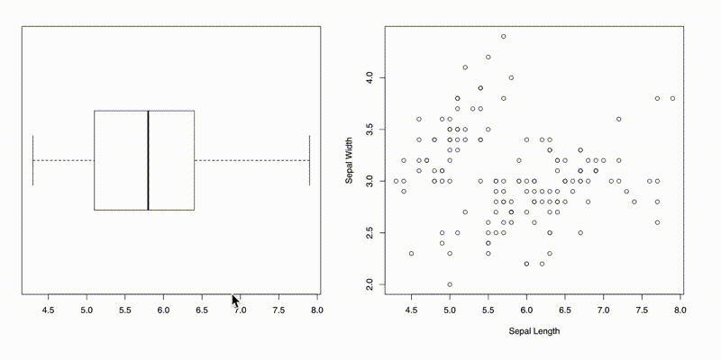

class: inverse

## The goal

> ### Investigate ways of producing web interactive plots in R, and come up with a possible solution that could be used with iNZight.

--

- introduce tools for creating web interactive visualisations

- realise they are great for certain interactions, but difficult
and not designed to be extended further

- introduce a flexible solution for turning static R plots
into interactive ones (interactr)

---
class: inverse

## Interactive graphics

exploratory data analysis

## Why the web?

accessible + portable

avoid installation issues and device compatibility

A good platform for displaying interactive graphics

---
class: inverse
## R -> Browser

```{r, out.width = "100%", fig.align = "center", echo = FALSE}
knitr::include_graphics('./img/d1.svg')
```
---
class: inverse
## plotly

```{r, out.width = "100%", fig.align = "center", echo = FALSE}
knitr::include_graphics('./img/plotly.gif')
```

---
class: inverse
## animint

```{r, out.width = "100%", fig.align = "center", echo = FALSE}
knitr::include_graphics('./img/animint.gif')
```

---
class: inverse
## R <-> Browser with shiny

```{r, out.width = "60%", fig.align = "center", echo = FALSE}
knitr::include_graphics('./img/shiny1.gif')
```

---
class: inverse
## ggvis

```{r, out.width = "80%", fig.align = "center", echo = FALSE}
knitr::include_graphics('./img/ggvis.gif')
```
---
class: inverse
## Lower level tools

gridSVG, DOM package + JavaScript achieve what we want but requires too much effort!

```{r, out.width = "40%", fig.align = "center", echo = FALSE}
knitr::include_graphics('./img/out.gif')
```
---
class:inverse
## How much?

```{r, fig.align = "center", echo = FALSE}

```

... and some more lines in JavaScript.
---
class: inverse
## So far...

These tools provide certain types of interactivity basically effort free,
but a huge effort is required in doing anything beyond what is canned.

- tendency to reproduce entire plots (shiny)

- cannot easily customise or add interactions onto the plot
  - not without expert knowledge + knowing web tech :(

- Limited support for other R graphics (lattice, graphics plots,
    'grid' plotting systems other than ggplot2)
---
class: inverse
## A more general solution for plots drawn in R

```{r, echo = FALSE}
knitr::include_graphics('./img/main-idea.svg')
```
<br>

- the **interactr** package provides functions to help make your static plot in R into something interactive

---
class: inverse
## Examples: A simple circle

.pull-left[
```{r, fig.keep = "none"}
library(grid)
library(interactr)

circle <- grid.circle(x = 0.5, y = 0.5, r = 0.25, name = "circle.A",
                      gp = gpar(fill = "yellow"))
listElements(circle)
```
```{r, eval = FALSE}
interaction <- list(hover =
                    styleHover(attrs = list(fill = "red",
                                            fill.opacity = "1")))
draw(circle, "circle.A", interaction, new.page = TRUE)
```
]

.pull-right[
```{r, out.width  = "60%", fig.align = "center", echo = FALSE}
knitr::include_graphics('./img/circle.gif')
```
]

---
class: inverse
## Examples: A linking box plot

```{r, fig.align = "center", out.width = "100%", echo = FALSE}

```

---
class: inverse
## Examples: Trend lines

```{r, out.width = "45%", fig.align = "center", echo = FALSE}

```

---
class: inverse
## Compatible with graphics plots

```{r, out.width = "100%", fig.align = "center", echo = FALSE}

```
---
class: inverse

## Compatible with ggplot2
```{r, out.width = "100%", fig.align = "center", echo = FALSE}

```

---
class: inverse
## Advantages

- Compatible with ggplot2, lattice, graphics plots

- Only updates specific components of the plot

- less effort in comparison to lower level tools

---
class: inverse
## Limitations

- Name matching between elements

--

```{r, eval = FALSE}
p <- ggplot(iris) + aes(x = Petal.Width, y = Petal.Length) + geom_point()
listElements(p)
```

```{r, out.width = "80%", echo = FALSE}

```
---
class: inverse
## More limitations

- Graphics device must be open in R

- need for simplicity + structure

- Only acts as a proof-of-concept

---
class: inverse
## Key takeaways

- There is a need for web interactive graphics

- Many of these tools are great for achieving certain interactions, but are canned
when going beyond

- interactr acts as a proof-of-concept for providing simple interactions to R plots (+ a possible solution for extending interactive features for iNZight)

- the world of web interactive graphics remains dynamic, and will continue to evolve

--

### Thank you! Questions? 
