# An overview of tools for achieving web interactive plots in R {#overview}

```{r include = FALSE, warning = FALSE, message = FALSE}
#load libraries:
library(crosstalk)
library(plotly)
library(DT)
library(ggvis)

#load datasets:
income <- read.csv('~/Desktop/datasets/nzincome.csv', header = TRUE)
```
There are many \textsf{R} packages that create different interactive data visualisations. Many of these connect \textsf{R} to specific JavaScript libraries. These include \textsf{Leaflet} [@leaf01] for rendering interactive maps and many popular graphing libraries including \textsf{highcharter} [@kunst01], \textsf{rbokeh} [@hafen01], \textsf{googleVis} [@gesman01] and the \textsf{rCharts} [@vaidyan13] package. These generate interactive plots or widgets known as htmlwidgets that can be viewed on a web page.
Other tools use \textsf{R} rather than JavaScript to drive interactivity, including \textsf{ggvis} [@ggvis01] and \textsf{shiny} [@shiny01]. The few that are discussed in this section in detail are  \textsf{plotly} [@plotly01], \textsf{ggvis}, \textsf{shiny}, and \textsf{animint} [@animint01].

## plotly {#plotly}

`plotly.js` is a JavaScript graphing library built upon \textsf{D3} [@bostock01]. The \textsf{plotly} package in \textsf{R} calls upon this library to render web interactive plots. The purpose of \textsf{plotly} in \textsf{R} is to provide a convenient way of creating interactive data visualisations [@sievert01]. With its API, we can generate a standard plot that can be shared and saved as an interactive HTML web page. One of the reasons why the \textsf{plotly} \textsf{R} package is useful is that it can automatically convert plots rendered in the very popular `ggplot2` [@ggplot01] package into interactive plots by simply applying the `ggplotly()` function to the plot drawn (see \autoref{fig:scatterplot-matrix}). It provides basic interactivity including tooltips, zooming and panning, selection of points, and subsetting groups of data as seen in \autoref{fig:plotly-iris}. We can also create and combine plots together using the `subplot()` function, allowing users to create facetted plots manually or combine different sets of types of plots together.

```{r, echo = FALSE, fig.cap = "\\label{fig:plotly-iris} A plotly plot of the iris dataset"}
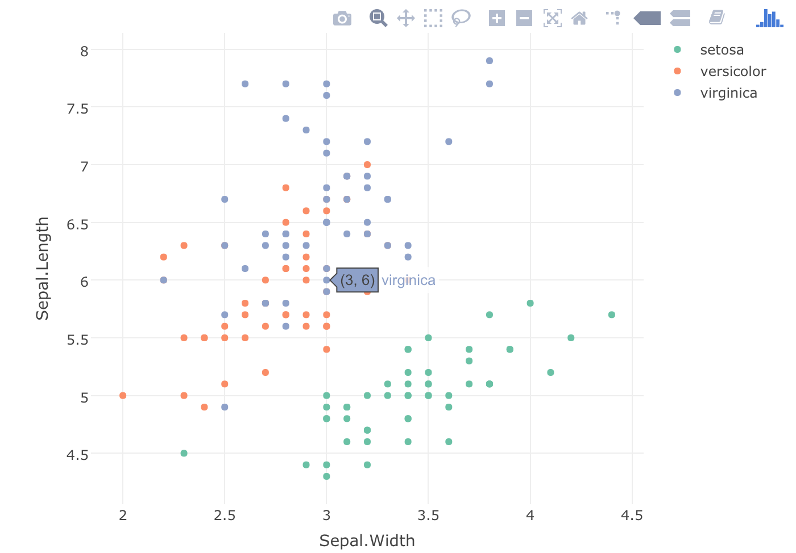
```

```{r, eval = FALSE}
plotly::plot_ly(data = iris, x = ~Sepal.Width,
                y = ~Sepal.Length, color = ~Species,
                type = "scatter", mode = "markers")
```

Like many other htmlwidgets, \textsf{plotly} can provide interactive plots quickly to the user with basic functionalities such as tooltips, zooming and subsetting. In \textsf{plotly}, there are a lot of features for building different plots. However, while we can build upon layers of plot objects, they cannot be pulled apart or modified without re-plotting. These plots natively do not provide more information about the data nor be linked to any other plot. However, this can be achieved by combining these widgets with crosstalk ([Section 2.1.1](#crosstalk)) or shiny ([Section 2.3](#shiny)).

It is difficult to customise interactions without a knowledge of the \textsf{D3}, JavaScript and the use of the `onRender` function from the \textsf{htmlwidgets} package. The other difficulty for the majority of users is knowing which elements to target and how it has been defined on the page. Sievert [-@sievert01] has shown an example of how a set of scatter points drawn with \textsf{plotly} can be selected via clicking which are linked to a google search page.

\textsf{plotly} is constantly being developed. As of writing, it has begun to expand on different methods of linking different views of plots and is able to create animated plots[@sievert01].

### Extending interactivity with crosstalk {#crosstalk}

\textsf{crosstalk} [@cheng16] is an add-on package that allows htmlwidgets to communicate with each other. As Cheng [-@cheng16] explains, it is designed to link and co-ordinate different views of the same data. Data is converted into a R6 `SharedData` object, which has a corresponding key for each row observation. When selection occurs, \textsf{crosstalk} communicates which keys have been selected and these widgets will respond accordingly. This all happens on the browser, where crosstalk acts as a 'messenger' between these widgets.

```{r, echo = FALSE, fig.cap = "\\label{fig:link-plotly} Linked brushing between two plotly plots and a data table"}
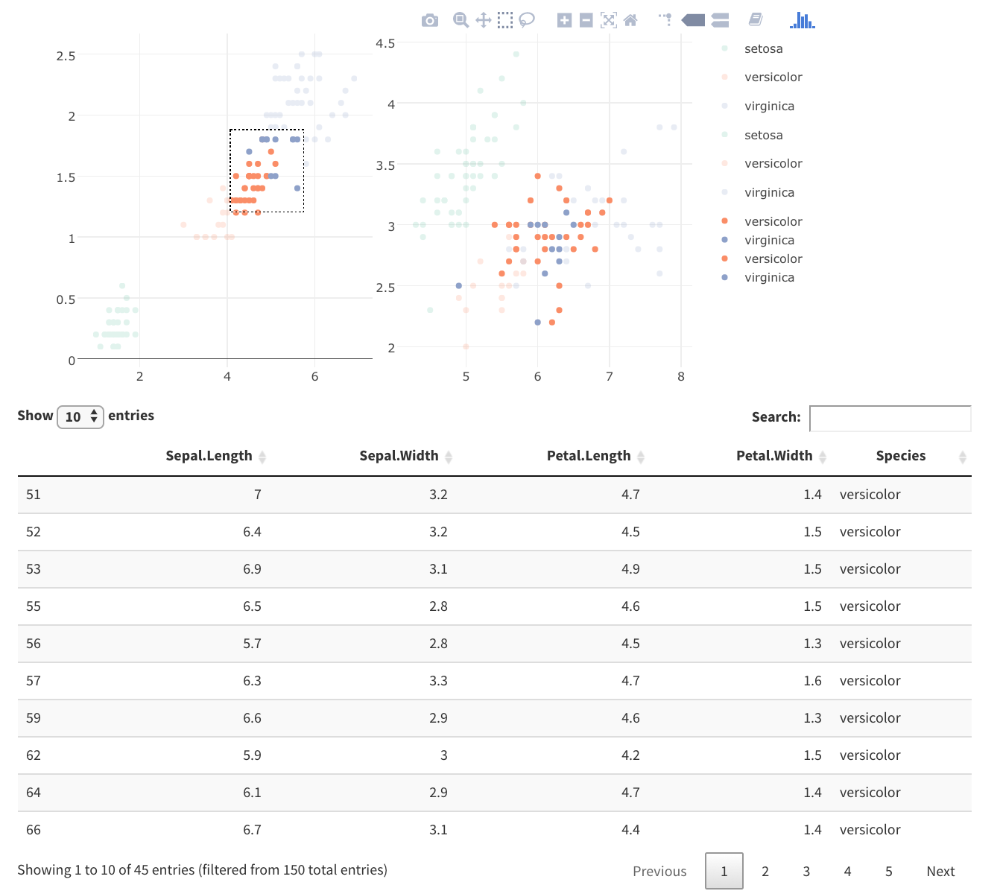
```

```{r, eval = FALSE, comment = NA}
#transform our data into a shared object
shared_iris <- SharedData$new(iris)
#generate plots
p1 <- plot_ly(shared_iris, x = ~Petal.Length,
              y = ~Petal.Width, color = ~Species, type = "scatter")
p2 <-  plot_ly(shared_iris, x = ~Sepal.Length,
               y = ~Sepal.Width, color = ~Species, type="scatter")
#layout the plots on the page, along with the data table
p <- subplot(p1, p2)
bscols(
  widths = 12, #need to scale accordingly
  p,
  datatable(shared_iris)
  )
```

In \autoref{fig:link-plotly}, we have linked two plots generated by \textsf{plotly} with a table generated by the \textsf{DT} [@dt01] package. When we select over a set of points in one of the plots, the table will respond by filtering all the points that have been selected and this selection is also highlighted on the other plot. Similarly, if we highlight on the other plot, that selection should change and be updated. This creates a form of multi-directional linking between different views of the iris data set.

```{r, echo = FALSE, fig.cap = "\\label{fig:crosstalk-plotly} Additional filtering and selection tabs using crosstalk"}
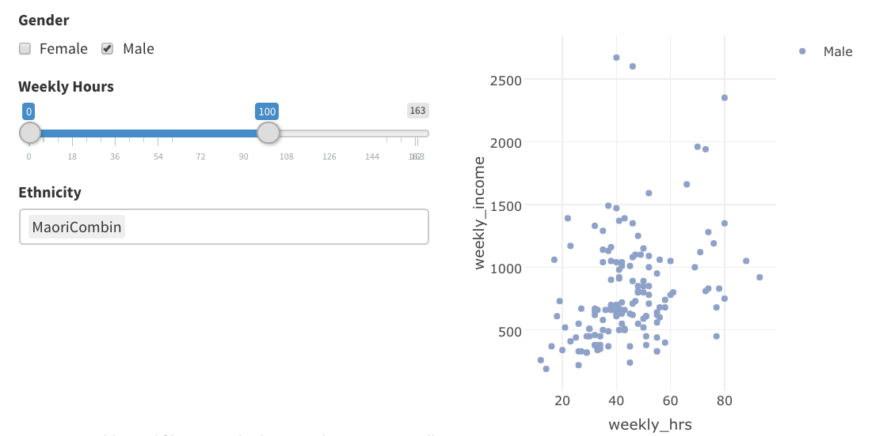
```

```{r, eval = FALSE, comment = NA}
shared_income <- SharedData$new(income)
bscols(
  widths = 6,
  list(filter_checkbox("sex", "Gender", shared_income, ~sex, inline  = TRUE),
       filter_slider("weekly_hrs", "Weekly Hours", shared_income, ~weekly_hrs),
       filter_select("ethnicity", "Ethnicity", shared_income, ~ethnicity)),
  plot_ly(shared_income, x = ~weekly_hrs, y = ~weekly_income,
          color = ~sex, type = "scatter", mode = "markers")
)
```

In \autoref{fig:crosstalk-plotly}, \textsf{crosstalk} can also be used for filtering. We can add specific inputs for filtering parts of our data set using sliders, checkboxes, and dropdown menus to allow more control over how we can subset and query our data.

However, \textsf{crosstalk} has several limitations. As Cheng [-@cheng16] points out, the current interactions that it supports are only linked brushing (\autoref{fig:link-plotly}) and filtering (\autoref{fig:crosstalk-plotly}) that can only be done on a single data set in a 'row-observation' format. This means that it cannot be used on aggregate data such as linking a density plot to a scatterplot, as illustrated in \autoref{fig:scatterplot-matrix} below. When we select over points over the scatterplot matrix, the density curves do not change as it cannot convert the selection into aggregated data.


```{r, echo = FALSE, fig.cap = "\\label{fig:scatterplot-matrix} A scatterplot matrix based upon the first five variables in the mtcars dataset"}
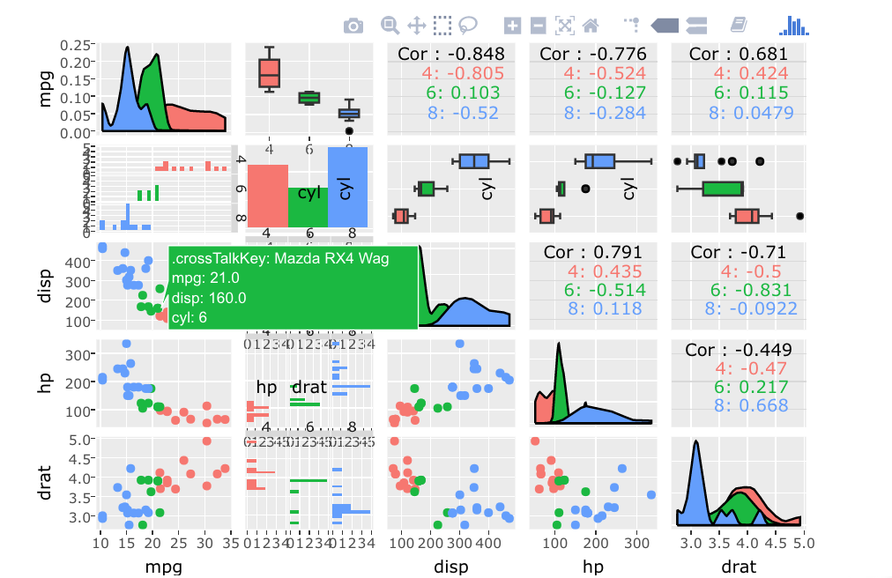
```

```{r, message = FALSE, eval = FALSE}
mtcars$cyl <- as.factor(mtcars$cyl)
shared_cars <- SharedData$new(mtcars[1:5])
pl <- GGally::ggpairs(shared_cars, aes(color = cyl))
ggplotly(pl)
```

Sievert [-@sievert01] explains that the densities do not update because there are no tools available in the `plotly.js` library or in the browser to recompute these densities. Similarly, aggregated displays including bar plots and box plots are not updated. However, it may be possible in a client-server framework such as \textsf{shiny} (discussed later in [Section 2.3](#shiny)), where we can call upon \textsf{R} to do the calculation. Because the `plotly.js` library recently has support for certain statistical functions that can aggregate data, \textsf{plotly} has expanded beyond linking between row-observation data. As of writing, these are still being continually developed. One of the main limitations of using \textsf{crosstalk} together with \textsf{plotly} is speed - there is a certain time lag before a user completes their query [@sievert01].

\textsf{crosstalk} only supports a limited number of htmlwidgets so far - \textsf{plotly}, \textsf{DT} and \textsf{Leaflet} [@cheng16]. This is because the implementation of crosstalk is relatively complex. From a developer's point of view, it requires creating bindings between crosstalk and the htmlwidget itself and customizing interactions accordingly on how it reacts upon selection and filtering. Despite being under development, it is recognised as being very promising. Other htmlwidget developers (notably, Kunst with \textsf{highcharter} [-@kunst01] and Hafen[-@hafen02] with \textsf{rbokeh}) have expressed interest in linking their packages with \textsf{crosstalk} to create more informative visualisations.

## ggvis {#ggvis}

Another common data visualisation package is \textsf{ggvis} [@ggvis01]. This package utilises the Vega JavaScript library [@vega01] to render its plots and uses the \textsf{shiny} framework to drive its interactions from R. It aims to be an interactive visualisation tool for exploratory analysis while following the "Grammar of Graphics" [@wilkin01], similar to \textsf{ggplot2} for static plots. It has an advantage over htmlwidgets as it expands upon using statistical functions for plotting, such as `layer_model_predictions()` for drawing trend lines using statistical modelling (see \autoref{fig:ggvis-02} which shows the fitting of a smoother to the weight and miles travelled per gallon of specific cars in the `mtcars` data set). Furthermore, because some of the interactions are driven by shiny [@ggvis02], we can add inputs that look similar to shiny such as sliders and checkboxes to control and filter the plot. We can also manually add tooltips as seen in \autoref{fig:ggvis-01}, which shows a basic \textsf{ggvis} plot of the iris data set with tooltips.


```{r, echo = FALSE, fig.cap = "\\label{fig:ggvis-01} A basic ggvis plot with tooltips"}
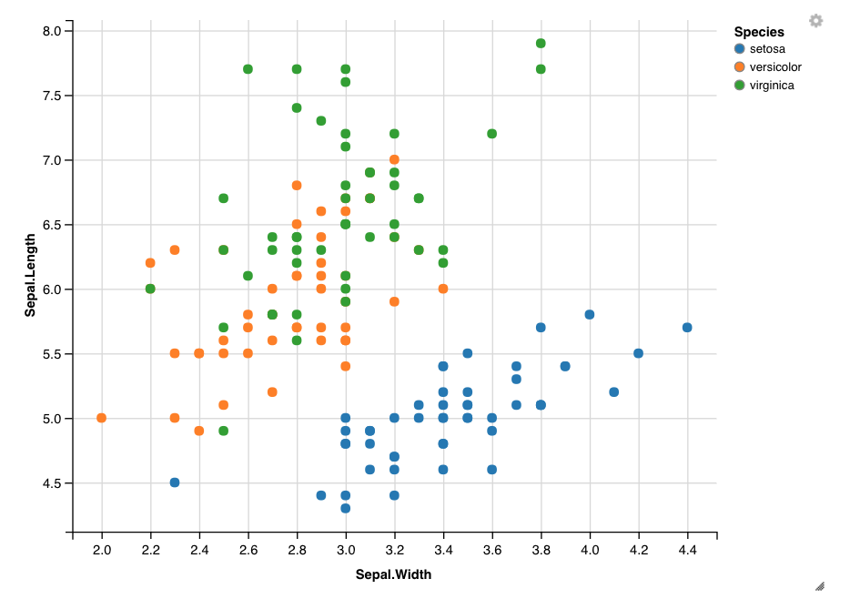
```

```{r, eval = FALSE}
ggvis(iris, ~Sepal.Width, ~Sepal.Length, fill = ~Species) %>%
    layer_points() %>%
    add_tooltip(function(iris) paste("Sepal Width: ", iris$Sepal.Width, "\n",
                                     "Sepal Length: ", iris$Sepal.Length))
```

```{r, echo = FALSE, fig.cap = "\\label{fig:ggvis-02} Change a trend line with a slider and filters using ggvis alone"}
knitr::include_graphics('./fig/ggvis-02.png')
```

```{r, eval = FALSE}
ggvis(mtcars, ~wt, ~mpg, fill = ~gear) %>%
  layer_points() %>%
  layer_smooths(stroke := "red",
                span = input_slider(0.5, 1,
                                    value = 1,
                                    label = "Span of loess smoother" )) %>%
  layer_model_predictions(stroke := "blue",
                          model = input_select(c("Loess" = "loess",
                                                 "Linear Model" = "lm",
                                                 "RLM" = "MASS::rlm"),
                                               label = "Select a model"))
```

However, while we are able to achieve indirect interactions, we are limited to basic interactivity as we are not able to link layers of plot objects together. The user also does not have finer control over where these inputs such as filters and sliders can be placed on the page. We also cannot save these interactions to a standalone web page as \textsf{ggvis} plots are driven by the \textsf{shiny} framework which requires \textsf{R}. There is an option of saving the plot as a static plot, either in SVG or PNG format. To date, the \textsf{ggvis} package is still under development with more features to come in the near future. With ggvis, we can go further by adding basic user interface options such as filters and sliders to control parts of the plot, however this is only to a certain extent.

We cannot combine different views of data using \textsf{ggvis}, \textsf{plotly} and other htmlwidgets alone. Interactivity can be extended with these packages by coupling it with \textsf{shiny}.

## shiny {#shiny}

\textsf{shiny} [@shiny01] is an \textsf{R} package that builds web applications. It provides a connection using \textsf{R} as a server and the browser as a client, such that \textsf{R} outputs are rendered on a web page. This allows users to be able to code in \textsf{R} without the need of learning the other main web technologies. A \textsf{shiny} application [@shiny02] can be viewed as links between inputs (what is being sent to \textsf{R} whenever the end user interacts with different parts of the page) and outputs (what the end user sees on the page and updates whenever an input changes).

To show how this works, we have created a simple \textsf{shiny} application that has a slider that controls the smoothness of the trend line. Whenever the user moves the slider, the plot will be redrawn and updated with a new smoother. \autoref{fig:shiny-diagram} is a diagram showing of how inputs work with outputs in the shiny application in \autoref{fig:simple-shiny}.

```{r, echo = FALSE, fig.cap = "\\label{fig:shiny-diagram} A diagram showing how an input affects an output (slider to plot)"}
knitr::include_graphics('./fig/shiny-diagram.svg')
```

```{r, echo = FALSE, fig.cap = "\\label{fig:simple-shiny} A simplistic shiny application that has a slider to control the smoothness of the trend line"}
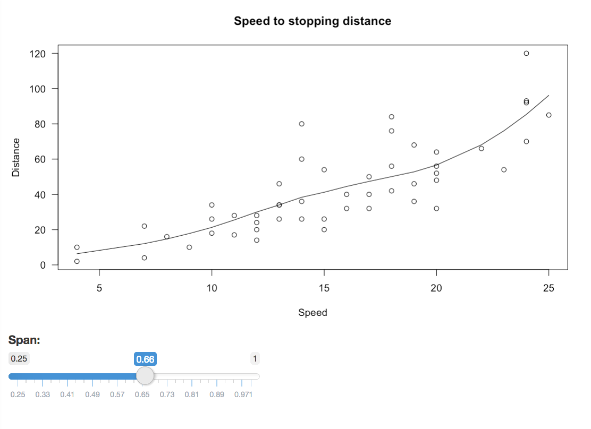
```

These applications can become more complex when more inputs and outputs are added. The main advantage of using \textsf{shiny} is that it establishes a connection to \textsf{R} to allow for statistical computing to occur, while leaving the browser to drive on-plot and off-plot interactions (briefly defined in [Section 1.1](#need)). This allows us to be able to link different views of data easily. Furthermore, RStudio [-@shiny04] has provided ways to be able to host and share these shiny apps via a shiny server. However, we are still limited in the sense that for every time we launch a \textsf{shiny} application, we do not have access to \textsf{R} as it runs that session. Additionally, \textsf{shiny} has a tendency to redraw entire objects whenever an 'input' changes as seen in \autoref{fig:simple-shiny}. This can lead to unnecessary computations and traffic between \textsf{R} and the webpage slows down the experience for the user. Despite this, it remains a popular tool for creating interactive visualisations.

There are many different ways to use shiny to create more interactive data visualisations - we can simply just use it to create interactive plots or we can go further and use it to extend the interactivity in \textsf{plotly}, \textsf{ggvis} and other \textsf{R} packages.


### Interactivity with shiny {#shiny-int}

\textsf{shiny} alone can provide some interactivity to plots [@shiny03]. \autoref{fig:inc-shiny-1} shows linked brushing between facetted plots and a table of the nzincome data set. With \textsf{shiny}, we are able to easily link plots together with other objects. This is done simply by attaching a `plot_brush` input, and using the `brushedPoints()` function to return what has been selected to R. As we select parts of the plot, we see this change occur as the other plot and the table updates and renders what has been selected. Other basic interactions include the addition of clicks (`plot_click`) and hovers (`plot_hover`).

```{r, echo = FALSE, fig.cap = "\\label{fig:inc-shiny-1} Facetted ggplot with linked brushing and hovers"}
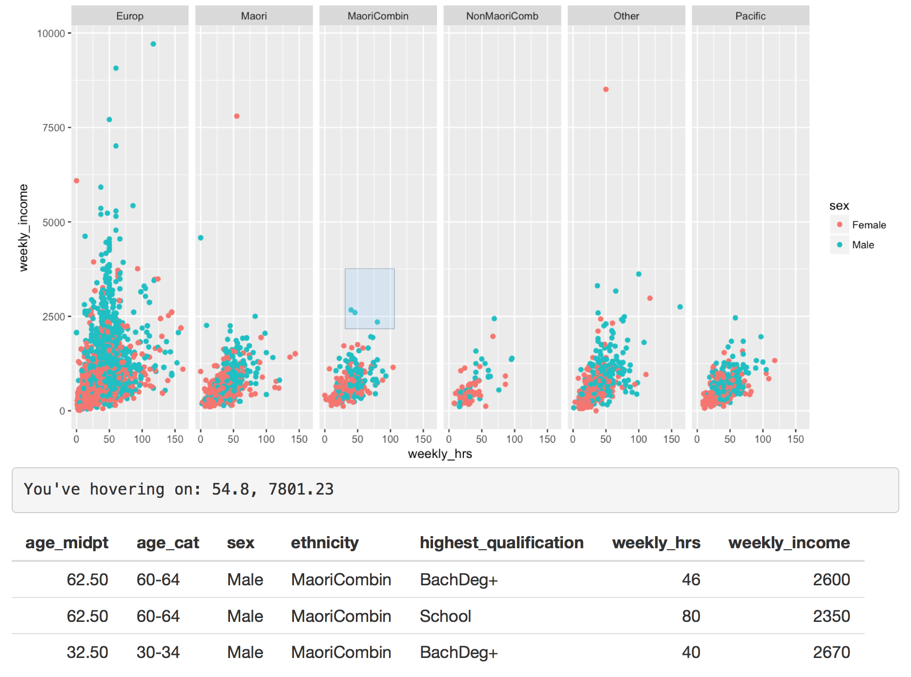
```

However, these basic interactive tools only work on base \textsf{R} plots or plots rendered with \textsf{ggplot2} and best with scatter plots. It is possible to extend this to bar plots, but it requires more thought. This is because the pixel co-ordinates of the plot are correctly mapped to the data [@shiny05]. When we try this on a lattice plot as seen below in \autoref{fig:inc-shiny-2}, this mapping condition fails as the co-ordinates system differs between the data and the plot itself. It is possible to create your own mappings to a plot or image, however it is complex to develop.

```{r, echo = FALSE, fig.cap = "\\label{fig:inc-shiny-2} A lattice plot that fails to produce correct mapping"}
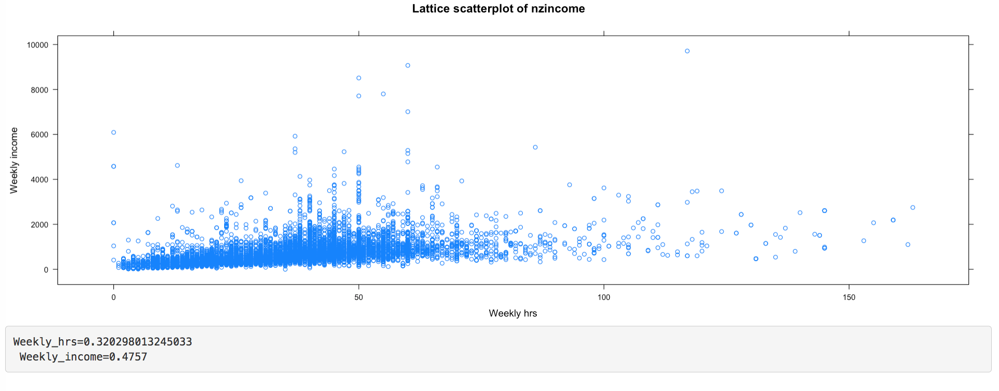
```

Because the plots are displayed as a single image, we can only view these plots as a single object and cannot pull apart elements on the plot. We are unable to further extend and add onto a plot, such as add a trend line when brushing or change colours of points when clicked on. Despite being limited to plot interactions such as clicks, brushes and hovers, we can use \textsf{shiny} to link multiple views of the data set.

### Linking plotly or ggvis with shiny {#plotly-shiny-ggvis}

Although \textsf{shiny} is great at facilitating interactions from outside of a plot, it is limited in facilitating interactions within a plot. It does not have all the capabilities that \textsf{plotly} and \textsf{ggvis} provides. When we combine the two together, more interaction can be achieved with less effort.

```{r, echo = FALSE, fig.cap = "\\label{fig:inc-plotly-shiny} A shiny application with a plotly plot with linked brushing"}
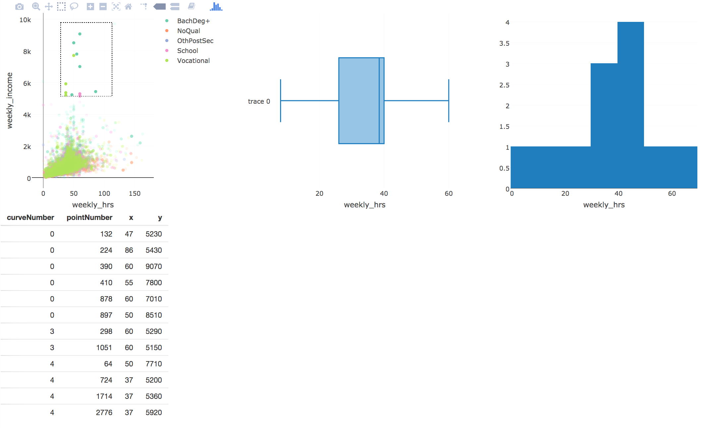
```

\textsf{plotly} (along with many other \textsf{R} packages that generate htmlwidgets) and \textsf{ggvis} have their own way of incorporating plots into a shiny application. In \autoref{fig:inc-plotly-shiny}, we can easily embed plots into \textsf{shiny} using the `plotlyOutput()` function. The \textsf{plotly} package also has its own way of co-ordinating linked brushing and in-plot interactions to other shiny outputs under a function called `event_data()` [@sievert03]. By combining it with \textsf{shiny}, we are able to link different plots together and to the data itself that is displayed as a table below. These in-plot interactions are very similar to what \textsf{shiny} provides for \textsf{graphics} plots and \textsf{ggplot2}. They work well on scatter plots, but not on other kinds of plots that \textsf{plotly} can provide. These can help generate or change different outputs on the page, but not within themselves. By combining the two together, we get on-plot functionalities from the htmlwidget, with off-plot driven interactions from \textsf{shiny}. Similarly, we can combine \textsf{ggvis} and \textsf{shiny} together to get similar results as seen in \autoref{fig:inc-ggvis-shiny}. \textsf{ggvis} has its own functions (`ggvisOutput()` and `linked_brush()`) that allow for similar interactions to be achieved [@ggvis02].


```{r, echo = FALSE, fig.cap = "\\label{fig:inc-ggvis-shiny} An example of linked brushing between ggvis plots"}
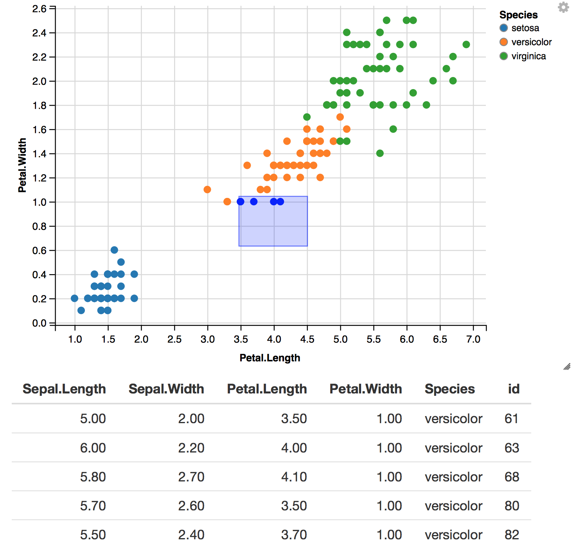
```

However, we are still left with a general problem of \textsf{shiny} (with the exception of \textsf{ggvis}) recomputing and redrawing a plot or widget every time an input changes. As of writing, work has been developed to prevent plots generated by \textsf{plotly} to only change certain parts of a plot whenever a plot is implemented with shiny. In a recent version of \textsf{plotly} (version 4.7.1), Sievert[-@sievert03] has shown that this is possible with a new feature called `plotlyProxy()`, but requires knowledge of the `plotly.js` library and how these proxy objects work.


## animint {#animint}

\textsf{animint} [@animint01] is an \textsf{R} package designed to allow users to create interactive and animated visuals using \textsf{ggplot2}. It uses the concept of direct manipulation defined in Scheiderman (1982). It focuses on adding two main aesthetics to \textsf{ggplot2} - `clickSelects` to allow the user to click on a selection, and `showSelects` that shows the current selection.  The user is able to directly click on the plot, which can be used to link multiple views of data on the same page.  It uses \textsf{D3} to generate the interactive plot on the page, and stores all the data in multiple TSV files that can be viewed locally.  

To illustrate, we create a simple example linking between gender and highest qualification to identify if there is a difference in income from the `nzincome` data set (\autoref{fig:animint}). When we click on the bars of the plot (left), we can subset the data by gender, while we can further subset the groups into qualification by selecting the legend on the scatter plot on the right. Overall,
across all qualification groups, there appears to be a difference between income levels by gender.

```{r, echo = FALSE, fig.cap = "\\label{fig:animint} An animint example linking a bar plot by gender to weekly hours and income from the nzincome data set"}
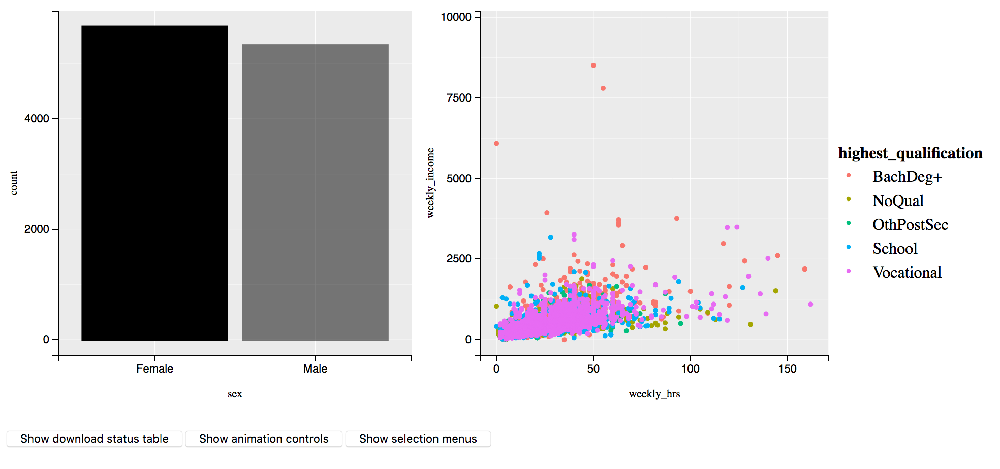
```

```{r, eval = FALSE}
library(animint)
plot1 <- ggplot(income) + aes(x = sex, clickSelects = sex) + geom_bar()
plot2 <- ggplot(income) + aes(x = weekly_hrs, y = weekly_income, showSelected = sex,
                              color = highest_qualification) + geom_point()

plotAll <- (list(p1 = plot1, p2 = plot2))
structure(plotAll, class = "animint")
```

If we click on any of the bars on the bar plot (left), the scatter plot (right) shows the selected points that correspond that that group.

Hocking's [-@animint01] example of the displaying different views of the World Bank dataset shows how complex interactive and animated plots can be achieved with less than 100 lines of code. It is simple and straightforward, and is not restricted to linking scatter plots as discussed with \textsf{crosstalk} and \textsf{plotly}.
Because plots are rendered entirely in JavaScript using D3, they are relatively more responsive and faster than compared to using a client-server framework like \textsf{shiny} which has an overhead cost from communicating between a remote server with \textsf{R} and the browser.

The key strength of \textsf{animint} is also its weakness as the only type of interactivity that can be achieved is clicking and showing what has been selected [@animint01]. Currently, it cannot achieve brushing or zooming and is only compatible with \textsf{ggplot2}. For more advanced users of \textsf{ggplot2}, not all `geoms` are supported, and may remain static when rendered with \textsf{animint}. Furthermore, because everything is computed and rendered beforehand, this means that if a selection requires a re-computation in \textsf{R} before it can be displayed, this is not possible. Hocking [-@animint01] suggests that a solution to this is to use \textsf{animint} with \textsf{shiny}, but this means that a new \textsf{animint} plot is rendered every time the user interacts with it. The unfortunate situation with creating stand-alone interactive plots this way is that the amount of data that needs to be generated to power the plots increases as we increase the number of subsets. If a data set has multiple subsets that need to be rendered, \textsf{animint} will need to make all the different combinations for each subset to link every plot together. The bigger the number of subsets and the larger the dataset, the number of files that need to be generated to drive the interactive or animated plot increases. In this case, using a client-server framework like shiny would be more suitable.

The \textsf{animint} package is promising for implementing a complex system that achieves interactive and animated plots that can be easily linked and implemented by users using clicks and selection, but there is still a great deal that it cannot do.

## Summary {#over-sum}

From assessing all these tools, we can summarise the features and drawbacks for each tool in the table below.

| Tool      | Type of plot | Compatible with shiny | Types of interactions | Redraws entire plot | Framework type |
|:-----------:|:-------------:|:----------------------:|:----------------------:|:--------------------:|:----------:|
| plotly    | plotly(plotly.js), ggplot2 | Yes | Clicks, brushing, subsetting, filters, zooming, rescales, linking multiple views with crosstalk (focuses more on on-plot interactions) | Yes (unless proxy) | standalone HTML |
| ggvis     | ggvis(Vega) | Yes | off-plot interactions, hovers, brushing (with crosstalk), filters, rescales (focuses more on off-plot interactions) | No | client-server |
| shiny     | \textsf{R} plots, anything compatible with it | - | clicks, brushing, filters, subsetting, hovers, able to link views (both on-plot and off-plot possible) | Yes | client-server |
| animint | ggplot2 (D3) | Yes | clicks + selects | No (unless used with shiny) | standalone HTML |

Table 1: A summary table of all the tools available and their main capabilities

Note: anything that is compatible with shiny will end up adopting its client-server framework.

Most of these tools can be extended using \textsf{shiny}. However the general problem is that when these systems are implemented with shiny (with the exception of \textsf{ggvis}), every time a user interacts with an input, the whole plot or corresponding widgets will be recomputed and redrawn. Furthermore, many of these do now allow us to customise our own interactions into the plot. We can use these tools for easily visualise our data with standard interactive plots, but if the user wishes to customise interactivity or extend it further, it presents a dead end or a need for learning its respective API. The other significant factor is that most these tools use a JavaScript library to render their plots. While graphics plots generated in \textsf{R} are supported by \textsf{shiny} and \textsf{ggplot2} across \textsf{plotly} and \textsf{animint}, there is no support for graphics generated with other plotting systems in R. Next, we will look at how we can achieve specific on-plot interactions on static \textsf{R} plots by combining JavaScript with lower levels tools and avoid reproducing entire plots whenever the user interacts with it.
