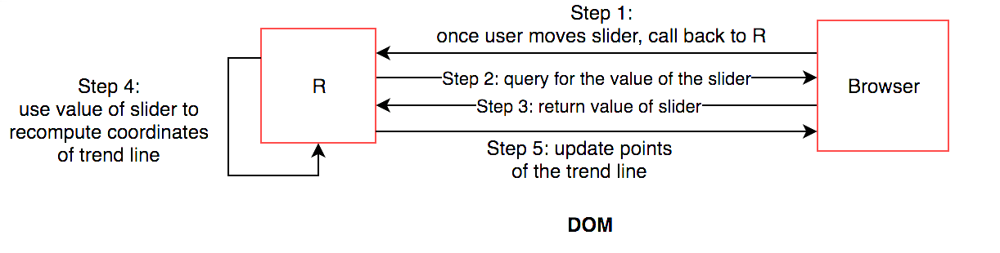

# Interactive R plots using lower level tools

```{r, include = FALSE}
library(grid)
library(gridSVG)
library(lattice)
```

Web interactive graphics can be achieved by R users without the knowledge of HTML, CSS and JavaScript. However, many of these tools use an external JavaScript library to render their plots. This section discusses how we can use two lower level packages,  \textsf{gridSVG}[@gridSVG01] and \textsf{DOM}[@DOM01] to incorporate interactions into R plots and prevent redrawing entire plots. One approach to avoid this is to target parts of the plot that need to be updated. We need a system that renders SVG elements but has a mapping structure that allows elements to be related back to data. In R, we can use the  \textsf{gridSVG} package. By combining  \textsf{gridSVG}, \textsf{shiny} and JavaScript, we are able to update specific parts of the plot when the user interacts with an input by passing JavaScript messages between R and the browser. Because interactions are achieved by manipulating web content using the \textsf{DOM}, we can alternatively use the \textsf{DOM} package that directly allows us to drive web content from R without the need for writing JavaScript. We will discuss how these different approaches work.

## gridSVG
 \textsf{gridSVG} [@gridSVG01] is an R package that allows for the conversion of grid graphics in R into SVG. This is powerful because it is easy to attach interactions to specific elements on the page. The advantage of using  \textsf{gridSVG} over others is that there is a clear mapping structure between elements in the data set and SVG elements generated. This is not clear in \textsf{plotly} or \textsf{ggvis} and their JavaScript libraries, which makes it hard to identify or trace data back to the elements on the page. This also explains why it may be difficult to customise interactions on the plot. With  \textsf{gridSVG}, we can add JavaScript to \textsf{grid} elements in R using `grid.script()` and `grid.garnish()` [@gridSVG02].

<embed src="./fig/circle.svg" type = "image/svg+xml" width = "200"/>


```{r, eval = FALSE}
grid.circle(x = 0.5, y = 0.5, r = 0.25, name = "circle.A",
            gp = gpar(fill = "yellow"))

grid.garnish('circle.A', onmouseover = "allred()",
             onmouseout = "allyellow()", "pointer-events" = "all")

grid.script("allred = function() {
  var circle = document.getElementById('circle.A.1.1');
  circle.setAttribute('fill', 'red');
  }")

grid.script("allyellow = function() {
  var circle = document.getElementById('circle.A.1.1');
  circle.setAttribute('fill', 'yellow');
  }")

grid.export("circle.svg")
```

```{r, echo = FALSE, out.width = "70%", fig.cap = "\\label{fig:circle-gridSVG} An interactive circle made using gridSVG - when the user hovers over the circle, it will turn red (shown on the right)"}
knitr::include_graphics('./fig/circle-DOM-1.png')
```

In \autoref{fig:circle-gridSVG}, the circle has been drawn in R, named and have interactive elements added before being exported out as an SVG. A simple interaction has been attached to the circle where if the user hovers over the circle, it will turn red.

This shows that there is a relationship between \textsf{grid} objects and SVG objects that are generated. In grid, we have named the circle as `circle.A`.  \textsf{gridSVG} maintains this as an grouped SVG element with an id attribute of `circle.A.1`, where inside lies a single SVG circle element called `circle.A.1.1`. In R, we can refer back to these \textsf{grid} objects to attach interactions to their SVG counterparts.

Another important feature  \textsf{gridSVG} has is the ability to translate between data and SVG coordinates[@gridSVG03]. Suppose that a plot has been generated. The `exportCoords` argument in `grid.export` is able to generate data that retains the locations of viewports and scales from the original plot in R (Murrell and Potter, 2012). We can use this information to convert data to SVG coordinates and vice versa.

To demonstrate, we have drawn a plot using the `cars` data set and exported its coordinate system with its corresponding SVG. We have separated the svg and the coordinates.

```{r, fig.keep = "first"}
xyplot(dist ~ speed, data = cars)
svgdoc <- grid.export(NULL, exportCoords = "inline")

# separate the svg and coordinates
svg <- svgdoc$svg
coords <- svgdoc$coords
```

To be able to use the coordinate system in R to convert between data and SVG coordinate systems, we need to load it in by calling `gridSVGCoords`.

```{r}
gridSVGCoords(coords)
```

Suppose we have a new point at (4, 5). To be able to convert this in the correct coordinate space, we need to find the correct viewport (identified as `panel`) it lies in. This can then be easily translated into SVG co-ordinates and back using the functions `viewportConvertX` and `viewportConvertY` with `panel`.

<!-- *Chris wants to know where the panel comes from* -->
```{r}
# to identify the correct panel:
panel <- "plot_01.toplevel.vp::plot_01.panel.1.1.vp.2"

# if there's a new point we want to find the SVG coordinates of:
(x <- viewportConvertX(panel, 4, "native"))
(y <- viewportConvertY(panel, 5, "native"))
```

The native co-ordinates (4, 5) have been translated as (`r round(x, 2)`, `r y`) in the SVG co-ordinate system. This can be further added on to the web page without redrawing the rest of the plot as we have the co-ordinates in the SVG space using JavaScript. We can also translated the coordinates back into data to return (4, 5).

```{r}
# to translate back to data (ie native):
viewportConvertX(panel, x, "svg", "native")
viewportConvertY(panel, y, "svg", "native")

```

The main limitations of this package are clear by its name. Only plots that are defined by the \textsf{grid} graphics system can be converted into SVG. This means that plots defined using base R cannot be directly converted [@gridSVG02]. There is a solution to this using the \textsf{gridGraphics} [@gridGra01] package that can converts base R graphics into \textsf{grid} graphics (further demonstrated in Section 4.2.1). Another point to note is that the process of converting elements to SVG becomes slow when there are many elements to render although work is under way on this to speed up conversion.

### Customising simple plot interactions

A clear limitation that is present in the existing tools discussed previously is letting the user add their own interactions on an existing plot.

<embed src="./fig/bp/boxplot.svg" type="image/svg+xml" />

```{r, echo = FALSE, out.width = "70%", fig.cap = "\\label{fig:bp-gridSVG} An example of a customised box plot interaction on an iNZight plot using gridSVG, JavaScript"}

```

One such example is highlighting part of a box plot to show certain values between the median and the lower quartile (\autoref{fig:bp-gridSVG}). When the user clicks on this box, it will highlight the points that lie within this range. While this can be achieved with  \textsf{gridSVG} and custom JavaScript, it is not as straightforward with \textsf{plotly} or \textsf{ggvis}. Despite \textsf{plotly} and \textsf{ggvis} also rendering graphs in SVG, it is more difficult to identify which elements to target and add interactions to with these systems.

### Preventing redraws in shiny using JavaScript messages and gridSVG

As mentioned at the end of Chapter 2, one of the downsides of using \textsf{shiny} along with \textsf{plotly} or other htmlwidgets is its nature to redraw plots every time an input changes. With R plots that are rendered using the `renderPlot` function, redrawing is required because the plot is viewed as a raster image. In other cases, \textsf{shiny} simply re-runs code when a user interacts with an input, which causes the plot to be redrawn. This means that we cannot specifically target elements on the page as the plot is viewed as a single object.

A new approach is to render the plot in SVG and target certain elements that need to be redrawn while using \textsf{shiny} to communicate back to R. If we use SVG, we can separate out which components to target and add interactions without changing the rest of the plot. A complication to this is that we can no longer use the usual \textsf{shiny} input and output functions that link everything on the page. \textsf{shiny} also does not have specific functions to control SVG content. A different way to do this is to pass data between the browser and back to R using JavaScript to change certain elements on the web page. \textsf{shiny} provides a set of functions that allow for messages to be sent through this channel using two JavaScript functions: `shiny.onInputChange()` and `shiny.addCustomMessageHandler()` [@heckmann01]. To send data from the browser back to R, we use `shiny.onInputChange()`. This allows JavaScript objects to be sent back to the \textsf{shiny} server in a way which can be recognised in R. To send data from R back to the browser, we use `shiny.addCustomMessageHandler()`.

To demonstrate how this is useful in updating certain parts of a plot, we provide an example by altering a smoothing curve using  \textsf{gridSVG} and these JavaScript functions. First, we use  \textsf{gridSVG} to generate our plot and identify the element corresponding to the trend line. We also need to export the coordinates in order to be able to transform data into the correct SVG coordinates when we update the co-ordinates of trend line.

```{r, echo = FALSE, out.width = "100%", fig.cap = "\\label{fig:tl-shiny-diagram} Diagram of how things work using shiny's JavaScript functions in Figure 3.4"}
knitr::include_graphics('./fig/tl-shiny-diagram.svg')
```

In \autoref{fig:tl-shiny-diagram}, we can pass the degree of smoothing value from the slider back to R. R then recalculates the x and y co-ordinates of the new smooth. Once these co-ordinates are calculated, they are sent back to the browser using `session$sendCustomMessage`. These coordinates are passed to `shiny.addCustomMessageHandler()` to run a JavaScript function that will update the points of the line. This process is used in \autoref{fig:tl-shiny} with a lattice plot of the iris data set.

```{r, echo = FALSE, out.width = "70%", fig.cap = "\\label{fig:tl-shiny} A replica of Figure 2.7, but only the trendline changes"}
knitr::include_graphics('./fig/tl-shiny.png')
```

This example (\autoref{fig:tl-shiny}) is extensible as we can render \textsf{grid} graphics (such as \textsf{lattice}) and customise interactions while maintaining a connection between R and the browser using \textsf{shiny}. By doing this rather than redrawing the entire plot, we have only changed the trend line. This method does, however, require the knowledge of JavaScript and the limitations of how much information can be sent through are unknown as it is not commonly used.

To stretch this example further, we added in a feature where the user can highlight over a set of points by dragging the mouse (as seen in \autoref{fig:tl-shiny-2}). We return the information about these highlighted points in order to further compute a smoother for just these points. To achieve this in \textsf{shiny}, we have written some JavaScript that returns the indices of these selected points back to R with `shiny.onInputChange()` to compute a suitable smoother which is then displayed.

```{r, echo = FALSE, out.width = "70%", fig.cap = "\\label{fig:tl-shiny-2} Select over a set a points to show a smoother"}
knitr::include_graphics('./fig/tl-shiny-2.png')
```

## DOM package

As highlighted in section 1, many interactions driven on the web are done by \textsf{DOM} (Document Object Model) manipulation. In brief, the Document Object Model is a programming interface that allows developers to manipulate content on a web page [@w3c]. We can use it to navigate and pinpoint specific elements on the page to modify and add interactions to. Generally, this is accessed through by writing JavaScript functions.

Because most interactions are driven by JavaScript and involve modifying content on the page, the \textsf{DOM} package [@DOM01] allows for us to directly do this from R. We can send requests back and forth between R and the browser. This provides a basis for using the web browser as an 'interactive output device' [@DOM02].

Using the \textsf{DOM} package allows us to write certain commands that are analogous to what is written in JavaScript. This removes the burden of traversing between the two programming languages. Rather than writing JavaScript, we can write \textsf{DOM} commands in R that produce similar results. Going back to our circle example in Figure 3.1, we can change the colour of the circle by directly sending this request to the web page.

```{r, echo = TRUE, eval = FALSE}
#changing the circle to red:
circle <- getElementById(page, "circle.A.1.1", response = nodePtr())
setAttribute(page, circle, "fill", "red")

```

In contrast, the JavaScript code for changing this circle from yellow to red:
```{js}
var circle = document.getElementById('circle.A.1.1');
circle.setAttribute(fill, "red");
```

The \textsf{DOM} package is also special in which we are able to do asynchronous programming (`async = TRUE`) [@DOM02]. Asynchronous programming is a concept where we are able to start an initial task and run different tasks at the same time. Here, the \textsf{DOM} package is able to run a task from R to the browser but also be able to run commands in R while the call to the browser is still running. This is important as it makes our web applications more efficient than trying to run each command or task one at a time. When we need to call back to R from the browser, these are all asynchronous events that can easily react to user interactions, making it more responsive and creates a smoother experience for the user.

\textsf{DOM} allows R to be called from the browser and for requests from R to be sent to the browser. To demonstrate this, we will replicate the hover effects on the circle as shown in Figure 3.1. \autoref{fig:circle-DOM-diagram} shows how this can be set up using \textsf{DOM}. We can use `setAttribute` to set the colour of the circle, and use the `RDOM.Rcall` function to send requests from the browser back to R. When the user hovers over the circle, the browser will send a request back to R to run the `turnRed` function, which in turn sends a request back to the browser to change the colour of the circle to red. Once the user hovers out, the browser will send a request back to R to turn it back to yellow. Our result is shown in \autoref{fig:circle-DOM-1}.

```{r, echo = FALSE, out.width = "70%", fig.cap = "\\label{fig:circle-DOM-diagram} Simple diagram showing how DOM works with from replicating Figure 3.1"}
knitr::include_graphics('./fig/circle-DOM-diagram.svg')
```

```{r, echo = FALSE, out.width = "70%", fig.cap = "\\label{fig:circle-DOM-1} DOM example of Figure 3.1 - when hovered, the circle turns red (right)"}
knitr::include_graphics('./fig/circle-DOM-1.png')
```

```{r, eval = FALSE}
#draw circle in grid
grid::grid.circle(x = 0.5, y = 0.5, r = 0.25,
                  name = "circle.A", gp = gpar(fill = "yellow"))
#export SVG
svg <- gridSVG::grid.export(NULL)$svg
dev.off()

#set up new page and add circle:
library(DOM)
page <- htmlPage()
appendChild(page,
            child = svgNode(XML::saveXML(svg)),
            ns = TRUE,
            response = svgNode())

circle <- getElementById(page, "circle.A.1.1", response = nodePtr())
# hover effects:
turnRed <- function(ptr) {
  setAttribute(page,
              circle,
              "fill",
              "red",
              async = TRUE)
}

turnYellow <- function(ptr) {
  setAttribute(page,
              circle,
              "fill",
              "yellow",
              async = TRUE)
}

setAttribute(page,
             circle,
             "onmouseover",
             "RDOM.Rcall('turnRed', this, ['ptr'], null)")

setAttribute(page,
             circle,
             "onmouseout",
             "RDOM.Rcall('turnYellow', this, ['ptr'], null)")

```

The example (\autoref{fig:circle-DOM-1}) takes approximately 40 lines of code for a hover effect. It is much more 'lower level' and requires the user to know how the Document Object Model and main web technologies work together.
A different approach would be to write some JavaScript and send it across to the browser from R. Since we are only just changing the colour of the circle, it is more efficient to write JavaScript and send it to the browser instead rather than telling the browser to call back to R. It is better to call back to R when a computation is necessary (such as recomputing a trend line's co-ordinates in the Section 3.2.1).

### Comparing DOM to shiny

\textsf{DOM} is similar to \textsf{shiny} as it establishes a connection between R and the browser. To compare, we have replicated \autoref{fig:tl-shiny} using \textsf{DOM}.

```{r, echo = FALSE, out.width = "70%", fig.cap = "\\label{fig:tl-DOM-diagram} Steps on how a trend line can be altered using the DOM package"}

```


The process of creating this example is similar to what was done with \textsf{shiny}. However, it is more difficult to set up as it requires the user to manually link all the components on the page. First, we draw the plot and save it as an SVG in memory. Next, we can add the SVG plot and a slider to the page. We identify which element corresponds to the trend line, and define what happens when the slider moves or when text is clicked. This requires an additional query to the browser to return the value of the slider before it can be returned back to R, as shown in \autoref{fig:tl-DOM-diagram}. These are co-ordinated using asynchronous callbacks, where once a response is returned, we can schedule another task behind it. These can be viewed as a series of steps that are linked together. Once the value of the slider is returned, we can use it to recalculate the coordinates of the trend line before updating it on the page. Our final result is put together in \autoref{fig:tl-DOM-2}.

```{r, echo = FALSE, out.width = "50%", fig.cap = "\\label{fig:tl-DOM-2} DOM example of Fig 3.4 for changing a trend line using a slider"}
knitr::include_graphics('./fig/tl-DOM-2.png')
```

\textsf{DOM} allows for more flexibility as we have control over the entire page. From a developer's perspective, we can continue to modify elements on the page. Users have access to R while the the connection to the web page is running. We can also run a number of interactive web pages in a single R session. In \textsf{shiny}, we are unable to use R in a single session or be able to change it without stopping the application. Furthermore, a \textsf{shiny} application can only do one task at a time, and cannot run tasks asynchronously. However, this may be resolved by the \textsf{promises} package [@promise01] in the near future, which allows for asynchronous programming within R and thus, more responsive \textsf{shiny} applications [@promise02].
A caveat of using the \textsf{DOM} package is that requires a lot more code to link everything together. In \textsf{shiny}, these links between inputs and outputs are much easier to co-ordinate.

Internally, there are many limitations with this package. As this package is still developmental, only part of the \textsf{DOM} (Document Object Model) API has been expanded, and the connection between R and the browser requires extra attention [@DOM02]. In some cases, it is still not possible to achieve certain interactions without  JavaScript, such as capturing where the mouse's position is on screen. Murrell [-@DOM02] states that it can only be run locally and is currently aimed at a single user rather than multiple users.

\textsf{gridSVG}, \textsf{DOM} and \textsf{shiny} provide ways in which we can bind custom JavaScript to elements, but requires the user to be able to define what kind of interactions they wish to achieve.

There is a clear trade off between existing tools. It is possible to customise interactions on existing plots, but this requires a knowledge of JavaScript in order to do so. Comparatively, tools that provide standard web interactive plots are easier to use but are complex to modify and extend further. In the next section, we discuss how we can simplify the implementation of certain interactions on plots originally rendered in R and build a solution using these tools.
