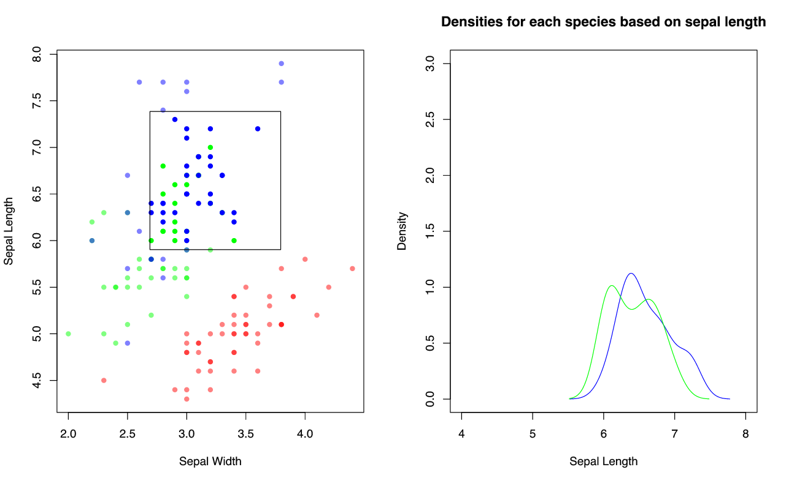
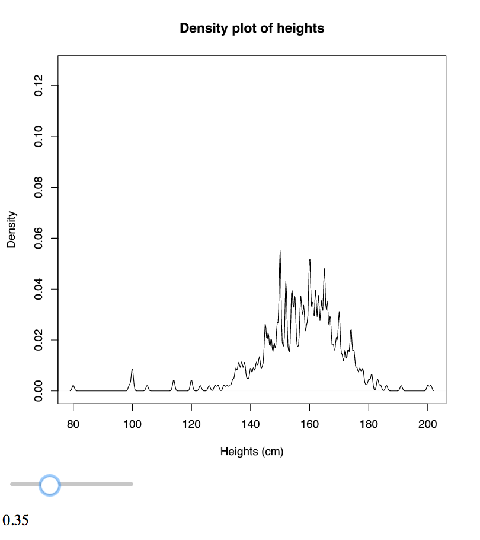

# Discussion {#discussion}

The \textsf{interactr} package provides a way of generating simple interactive \textsf{R} plots that can be viewed in a web browser. It is advantageous in the sense that we can define and customise interactions with flexibility. It can also achieve unidirectional linking between plots. However, there are many limitations present with its current implementation and is not yet recommended for general use. But it does have potential to be further developed in the future. In this section we will discuss the advantages [(Section 5.1)](#advantages) and limitations of this method [(Section 5.2)](#limitations), and further compare it to existing tools [(Section 5.3)](#comparetools) where we also briefly comment on future directions for developing \textsf{interactr}.

## Advantages {#advantages}

The idea of \textsf{interactr} is inspired from finding an easier way to customise certain interactions onto plots drawn in \textsf{R} without the need to learn JavaScript. It takes advantage of R's flexible graphics system and caters for both \textsf{graphics} and \textsf{grid} plots.

Using the DOM package allows us to use \textsf{R} to recompute and do calculations that originally cannot be done in JavaScript, such as recomputing densities on a plot based upon a selection. Below is an example of changing density plots based upon what the user has selected (\autoref{fig:int-density}).


```{r, echo = FALSE, fig.cap = "\\label{fig:int-density} Different selections (left) recompute different densities (right) with interactr"}

```

The main advantage for identifying graphical elements to data is that we have more flexibility in targeting sub components of a plot. A prime example of an interaction that is difficult to implement across other tools is linking a part of the box plot to other plots (seen in [Section 4.2.1](#boxplot)).

Another advantage is that we are able to add layers on top of plots and draw shapes that can help provide more information. This cannot be easily done by the existing tools as it requires information on how these plots are layered and rendered. With \textsf{gridSVG} underneath to provide a clear mapping structure of these layers, we can add on elements to existing plots on the web page to show more about a user's interaction such as a selection or a click. They can also be used to highlight regions and draw new elements. The is exemplified in the trend line example in [Section 4.2.2](#trendline), where an additional smoother can be added to the plot.

\textsf{interactr} can be used to create links between plots via clicks and selection boxes. Here, a single plot can control the rest of the plots. It may be possible to create multi-directional links, but this becomes more complex to co-ordinate. It is a success in its own for providing basic interactions to any type of plot drawn in R. However, there are still many limitations with its current implementation.

## Limitations {#limitations}

With \textsf{gridSVG}, one major limitation is that only \textsf{grid} objects can be converted into SVG. This limits us to plots that must be drawn in \textsf{R} to a graphics device before it can be sent to the browser. A further limitation is that \textsf{gridSVG} is relatively slow when we try to convert a plot made up of many elements. Currently, work is proceeding to make \textsf{gridSVG} faster.

Because \textsf{interactr} is mainly built upon the \textsf{DOM} package, many of the limitations of \textsf{DOM} highlighted in [Section 3.2](#DOM) are carried over. Applications made with \textsf{DOM} are generated for a single user in a single session only. Furthermore, because the \textsf{DOM} package is still under development, it cannot be used for production purposes yet. Just as \textsf{shiny} applications require a \textsf{shiny} server for them to be hosted on the web, \textsf{DOM} would require something similar to allow for applications to be shared and accessed. A few trials using a \textsf{shiny} server have been successful, but these only act as a provisional solution. Furthermore, because the underlying system involving requests being sent between \textsf{R} and the web browser, this can be slower than plots that are driven fully by JavaScript.

There are further limitations with its current implementation. The approach is based upon the graphical elements produced. This requires the user to be able to link the particular elements of the data which is more tedious than the existing tools discussed in [Section 2](#overview) that link data to graphical elements on the page. The user must call `listElements` before sending the plot to the browser as it prints the plot to a current device and returns a list of elements that make up the plot. This is crucial for plotting systems that do not have a consistent naming scheme. If we reprint the plot, the tags will constantly change which may cause a mismatch between element matching between the plot on the web and the plot in R. This occurs with \textsf{ggplot2}, where if we re-plot with the exact same command, the names of these elements change every time. Another problem with using `listElements` is that the user will need to deduce which element corresponds to what is seen on the plot. The naming for these objects in by these plotting systems may not be clear. If it is a plot that is made directly from \textsf{grid} where the user has named everything clearly, then this is not a problem. The code below shows the difference between the naming scheme in lattice (\autoref{fig:lat-plot}) and \textsf{ggplot2} (\autoref{fig:gg-plot}).

Listing the elements from a plot produced with lattice:

```{r p1, fig.cap = "\\label{fig:lat-plot}Listing the elements of a plot using lattice", comment = NA}
sp <- xyplot(Petal.Length ~ Petal.Width, data = iris)
listElements(sp)
```

Listing the elements from a plot produced with \textsf{ggplot2}:

```{r p2, fig.cap = "\\label{fig:gg-plot} Listing the elements of a plot using ggplot2", comment = NA}
p <- ggplot(iris) + aes(x = Petal.Width, y = Petal.Length) + geom_point()
listElements(p)
```

Another limitation is the number of interactions that can be attached. So far, the examples expressed in Section [4.2](#examples) require a single element to be controlled and assumes that each grid object listed corresponds to a single SVG element. We can attach many interactions and events to a single element at a time, but not many elements to many different interactions at once. There is a need for a more flexible system when dealing with multiple interactions for achieving more complex interactions. Furthermore, only one kind of interaction can be expressed for a single event. This means that the function created by the user must be fully defined in a single function rather than multiple functions. For example, if a hover requires both adding a tooltip and to turn the element red, then this would need to be written as a single function as we can only attach one to each event.

Code must also be written in a certain order to work. Plots in \textsf{R} must be drawn to a graphics device before being sent to the browser, while a new web page must be set up before we can start adding elements and interactions to the page. These devices must still be open in order to communicate and retrieve existing information about the plot. In cases of dealing with multiple plots, one of the disadvantages is that we lose information about the previous plot in R. This means that the user is required to identify what kind of information they need to extract before they move onto the next plot. This is demonstrated in the example in [section 4.2.1](#boxplot) of linking a box plot to other plots together. Before the user can move onto the scatter plot, the range of the box and viewports were stored in order to be used in the defined function. This means that we cannot jump back and forth between plots. A possible solution to this is to store the information about each plot that is sent to the web browser so that it can be retrieved by the user if needed in R. Another approach would be to plot all necessary plots in a single window which would eliminate the need for this.

A further assumption that the \textsf{interactr} package currently has is that the `native` units in \textsf{grid} represent the data values that are plotted. As discussed in [Section 4.3.2](#ggplot2), \textsf{ggplot2} uses a different co-ordinate system and this assumption does not hold. Instead, we need to take a detour and get the data values that are stored in `ggplot_build()`.

## Comparison to existing tools {#comparetools}

\textsf{interactr}'s main point of difference is the ability to replicate plots or objects drawn in \textsf{R} (in both graphics systems) and to achieve on-plot and off-plot interactivity. \textsf{shiny} can do this but you cannot easily attach specific interactions as the whole plot is rendered as a single raster image file (such as a png). Furthermore, many of these existing tools rely on the \textsf{shiny} framework. As highlighted in [Section 2.3](#shiny), one of the major disadvantages that \textsf{shiny} possesses is a tendency to recompute and redraw entire plots whenever an input changes. In \textsf{interactr}, only the part of the plot that the user specifically targets is modified and customised interactions can be achieved.  It provides a possible way of linking different types of plots together, whereas existing tools, specifically crosstalk, have focused on linked brushing between 'row-observation' data. To put this into perspective, the simple example of linking box plots to other types of plots in \autoref{fig:int-bp-3} is an interaction that is difficult to achieve without expert knowledge of their respective APIs.

In comparison to the existing tools discussed in [Section 2](#overview), \textsf{interactr} has a more complex API for users. The main reason for this is to increase flexibility across creating different types of interactions. But this is entirely developmental. In comparison to using \textsf{DOM} and \textsf{gridSVG} directly, it provides convenience for certain processes, such as drawing an SVG plot and adding elements to the web page and styling hovers. Currently, only certain interactions highlighted in [Section 4.2](#examples) can be achieved.

 There is potential for designing a more simpler and structured API that is more intuitive for developers and users. An example to highlight this is changing the bandwidth of a density plot (shown below with \textsf{interactr} in \autoref{fig:d1}). This example has been replicated with \textsf{ggvis} (\autoref{fig:d2}), \textsf{shiny} (\autoref{fig:d3}), and with \textsf{plotly+shiny} (\autoref{fig:d4}). The \textsf{animint} package will not be able to do this because it is restricted to clicks and selection.

```{r, echo = FALSE, out.width = "60%", fig.cap = "\\label{fig:d1} Control density bandwidth with interactr"}

```

```{r, echo = FALSE, out.width = "65%", fig.cap = "\\label{fig:d2} Control density bandwidth with ggvis"}
knitr::include_graphics('./fig/ggvis-density.png')
```

```{r, echo = FALSE, out.width = "65%", fig.cap = "\\label{fig:d3} Control density bandwidth with shiny"}
knitr::include_graphics('./fig/shiny-density.png')
```

```{r, echo = FALSE, out.width = "65%", fig.cap = "\\label{fig:d4} Control density bandwidth using plotly (rendered with ggplot2) and shiny"}
knitr::include_graphics('./fig/ggplotly-density.png')
```

| Tool       | Approximate number of lines of code | Redraws/reproduces entire plot | Scale of axes change | Plot type rendered|
|:------------:|:------------:|:------------:|:------------:|:----------:|
| interactr (DOM+gridSVG+grid)  |     18     |     No     |     No     |  base \textsf{R} |
| ggvis      |      3     |     No     |     Yes    |  Vega   |
| plotly+shiny|     10    |    Yes     |    Yes     |  ggplot2 (via ggplotly) |
| shiny      |      10    |    Yes     |     Yes    | base \textsf{R} |

Table 5.1: A comparison table between existing tools and \textsf{interactr} on changing the bandwidth of a density plot

From replicating each example, we find that the \textsf{interactr} package will not change the scale of its axes when the bandwidth is changed. This is because we are only updating the density line relative to the coordinates of the axes. In comparison to the rest of the tools, more lines of code are required to generate the same effect, and those involving shiny reproduce the entire plot every time.

Because many of these existing tools are still being developed, it is likely that they will resolve some of the limitations discussed in [Section 2](#overview) in the future. However, they require the user to be very familiar with their APIs. An example of this is the \textsf{plotly} package that has been expanded further into achieving linking between other types of plots and the ability to prevent redrawing when used with \textsf{shiny}. It requires the user to know both the plotly API, \textsf{shiny}, and the `plotlyProxy()` functions [@sievert03] as briefly mentioned in [Section 2.3.2](#plotly-shiny-ggvis). The same applies for \textsf{interactr}. There is still a long way to go before we are confident enough to claim that users would not need to know \textsf{DOM}, grid, and \textsf{gridSVG}.

## Future directions {#future}

The problem of handling large number of individual objects in a plot remains unresolved as the browser cannot handle too many SVG elements at once. This is a general problem that occurs across all existing tools. A solution is to render using webGL and HTML canvas environments which allow for many elements to be rendered without compromising speed. However, the problem with this is that it is not as straightforward to attach events to these elements. This is because they generally treated as a single object thus making it difficult to address sub-components.

There is potential in developing \textsf{interactr} further to try achieve complex interactions that are more useful in exploratory data analysis. Currently, it is only a proof-of-concept prototype and still undeveloped in many areas. Only a very small number of examples have been successful and a limited number of interactions have been implemented. There is still a need for a simpler and versatile system for users without compromising the flexibility in which the user can define interactions and \textsf{interactr} is a step along this path. Other possible ideas may that may be incorporated include integrating plots with \textsf{D3} and other htmlwidgets to achieve special effects such as zooming and panning of a plot and to achieve multi-directional linking. It may become compatible with \textsf{iNZight} which also uses the grid system to produce its plots. However, this requires assessment on how the underlying grid objects are named and drawn before being implemented.

## Conclusion {#conclude}

There is a need in expanding web interactive graphics to create better data visualisations for users. Despite having many tools available including \textsf{plotly}, \textsf{ggvis}, \textsf{shiny} and \textsf{animint} and many other packages that produce htmlwidgets, these generally produce standard interactive plots outside of \textsf{R} that are hard to customise. Our new tool \textsf{interactr} provides a way of driving interactions without the need of learning web technologies while utilising the power of R's statistical computing to aid changes in plots originally drawn in \textsf{R}. However, more assessment and development is required on building more informative interactive visualisations before it can catch up to the capabilities of older *desktop* applications.

## Additional resources {#addresource}

The \textsf{interactr} package is currently hosted on Github here:
https://github.com/ysoh286/interactr

To install \textsf{interactr}, you need to install DOM v0.4:
```{r, eval = FALSE}
install.packages("https://github.com/pmur002/DOM/archive/v0.4.tar.gz",
                repos = NULL, type = "source")
devtools::install_github('ysoh286/interactr')
```

For more details about this project, visit this repository which contains code and additional notes:
https://github.com/ysoh286/honours-project-2017

To view the online version of this report with interactive examples:
https://ysoh286.github.io/honours-project-2017/
